# ⚡ Minus CLI — The Next-Gen Autonomous AI Coding Engine & Multi-Agent Swarm

> **Minus CLI** (CodingAgent) là một hệ thống **Autonomous AI Software Engineer & Multi-Agent Swarm Kernel** mã nguồn mở được phát triển hoàn toàn bằng **TypeScript & Node.js**, sở hữu kiến trúc Microkernel phân tầng khép kín, vượt trội hơn các chuẩn mực của OpenAI Codex CLI, Google Antigravity CLI và Claude Code.

[](https://www.typescriptlang.org/)
[](https://nodejs.org/)
[-brightgreen.svg)]()
[]()
[]()

---

## 🚀 Vì Sao Minus CLI Vượt Xa Các Coding Agent Hiện Đại?

Dự án loại bỏ hoàn toàn sự phụ thuộc vào các framework AI cồng kềnh (LangChain, CrewAI, AutoGen) để trực tiếp làm chủ lõi động cơ từ gốc:

| Tiêu Chí Kiến Trúc | OpenAI Codex CLI | Google Antigravity CLI | Claude Code | ⚡ **Minus CLI (CodingAgent)** |
| :--- | :---: | :---: | :---: | :---: |
| **Code Knowledge Graph (360° AST)** | ⚠️ Grep text / ctags thô sơ | ⚠️ Đọc file tĩnh | ⚠️ Search text / Grep | 💎 **Native AST 360° Symbol Panorama, Call Hierarchy 2 chiều, API Route Mapper, Circular Dependency Topology** |
| **Độ An Toàn Sửa Code (Mutation Safety)** | ⚠️ Ghi đè file trực tiếp | ⚠️ Ghi đĩa trực tiếp | ⚠️ Ghi đĩa trực tiếp | 💎 **5-Stage Pipeline: RAM Preflight, In-Memory Transaction, SHA-256 Hash Lock, Zero-Disk Pollution on Error** |
| **Nghiệm Thu Giải Pháp (Completion Gate)** | ❌ Dựa vào LLM tự nhận hoàn thành | ❌ Dựa vào LLM tự nhận hoàn thành | ⚠️ Hạn chế | 💎 **Evidence-Gated Completion Gate (`CriticGate`): Bắt buộc có bằng chứng test thực tế sau lần sửa đổi cuối** |
| **Tối Ưu Token & Prompt Caching** | ⚠️ Caching cơ bản | ⚠️ Caching session | ✅ Prompt Caching | 💎 **Layered KV-Cache Prefix Alignment + Dynamic Tool Retrieval (RATS) + Tail-end Synergy Advisor ($\ge 85\%$ Cache Hit)** |
| **Xử Lý Lỗi Quota & Rate Limit (429)** | ❌ Crash hoặc fail lượt gọi | ❌ Dừng phiên | ⚠️ Retry cơ bản | 💎 **Exponential Backoff Jitter + Graceful Suspension Protocol (Bảo toàn 100% Plan/Goal, `/plan resume` tức thì)** |
| **Tiến Trình Dài Hạn & Reactive Waiting** | ⚠️ Poll loop tốn token | ✅ Schedule & Task tool | ⚠️ Poll command | 💎 **Dual Execution Mode (Sync/Async auto-detect) + Reactive Watchdog Timer (Zero-Polling) + Stdin REPL Control** |
| **Hợp Tác Đa Agent (Multi-Agent Swarm)** | ❌ Đơn luồng | ⚠️ Subagents cơ bản | ❌ Đơn luồng | 💎 **Blackboard OCC (`versionHash`), Pub/Sub Agent Event Bus, Swarm Capability Matching (`allocateTask`)** |
| **Kiểm Thử Toàn Diện Hệ Thống** | Ẩn mã nguồn | Ẩn mã nguồn | Ẩn mã nguồn | 💎 **36 Sections kiểm thử nghiêm ngặt (787/787 Tests Passed 100%)** |

---

## 🎯 Kiến Trúc Vận Hành Khép Kín (Closed-Loop Autonomous Architecture)

Minus CLI vận hành dựa trên một chu trình **OODA Loop (Observe – Orient – Decide – Act – Verify)** khép kín tuyệt đối:

```text
                                        ┌────────────────────────┐
                                        │    USER / DEVELOPER    │
                                        └───────────┬────────────┘
                                                    │ Prompt + @Context Attachment (/plan, /goal, /sessions)
                                                    ▼
                                        ┌────────────────────────┐
                                        │  CLI REPL & UI Layer   │ (Slash Commands, Real-time Mentions,
                                        │      (cli-ui.ts)       │  Prompt Cache Telemetry & Spinners)
                                        └───────────┬────────────┘
                                                    │
                                                    ▼
 ┌────────────────────────────────────────────────────────────────────────────────────────────────────────┐
 │ 1. INTAKE & LAYERED KV-CACHE PREFIX (AgentKernel)                                                      │
 │  - Layer 1: Immutable Static System Prompt (prompts.ts)    - Layer 2: Sorted Tool Declarations (RATS)  │
 │  - Layer 3: Append-Only Event Sourced Session History      - Layer 4: Tail-end Dynamic Tool Advice     │
 └──────────────────────────────────────────────────┬─────────────────────────────────────────────────────┘
                                                    │
                                                    ▼
 ┌────────────────────────────────────────────────────────────────────────────────────────────────────────┐
 │ 2. ADAPTIVE REASONING & ROUTING (AgentLoop)                                                            │
 │  - AdaptiveReasoningController (System 2 Thinking: Medium 8k ──► High 16k ──► Max 32k)                 │
 │  - FallbackRouter (Gemini 2.5 Flash ──► DeepSeek Reasoner ──► OpenAI-Compatible)                       │
 │  - Rate Limit Exponential Backoff Jitter & Graceful Goal Suspension on Quota Exhaustion                │
 └──────────────────────────────────────────────────┬─────────────────────────────────────────────────────┘
                                                    │
                                                    ▼ Model Decision
                        ┌───────────────────────────┴───────────────────────────┐
                        │                                                       │
                 [Tool Call Action]                                    [submit_solution]
                        │                                                       │
                        ▼                                                       ▼
 ┌──────────────────────────────────────────────┐        ┌──────────────────────────────────────────────┐
 │ 3. 5-STAGE SURGICAL EXECUTION PIPELINE       │        │ 5. EVIDENCE-GATED COMPLETION GATE            │
 │  1. Schema & Parameter Validation            │        │  - CriticGate: Solution quality evaluation   │
 │  2. Security & Path Resolution (Jail check)  │        │  - Seq Check: seq_verify > seq_mutate        │
 │  3. Mutation Lock: Optimistic SHA-256 Hash   │        │  - Digest Check: workspaceDigest intact      │
 │  4. RAM Preflight (MutationTransaction)      │        │  - Diff Hash Check: diffHash matches test    │
 │  5. Execution Engine:                        │        │  - Baseline Check: (post - baseline) === 0   │
 │     ├─ Code Graph: 360 Context / Call Graph  │        └──────────────────────┬───────────────────────┘
 │     ├─ Mutation: create/replace/patch/delete │                               │
 │     ├─ Multi-Agent: Blackboard OCC / Events  │                 ┌─────────────┴─────────────┐
 │     ├─ Process: Async Tasks / Reactive Timer │                 ▼                           ▼
 │     └─ Web: Live Search / Markdown Fetch     │          [VERIFIED PASS]             [REJECTED]
 └──────────────────────┬───────────────────────┘                 │                           │
                        │                                         ▼                           │
                        ▼                               🏁 TASK COMPLETED                     │
 ┌──────────────────────────────────────────────┐     (Evidence Proven on Disk)               │
 │ 4. OBSERVATION, REFLECTION & SELF-CRITIQUE   │                                             │
 │  - Append to Session Event Log (.jsonl)      │                                             │
 │  - ToolSynergyAdvisor: Next-Step Advice      │                                             │
 │  - ReflectionEngine: Synthesize fix prompt   │                                             │
 │  - HypothesisRollback: Clean slate on falsify│                                             │
 └──────────────────────┬───────────────────────┘                                             │
                        │                                                                     │
                        └───────────────────────────◄─────────────────────────────────────────┘
                                         (Next Iteration / Healing Loop)
```

---

## 🧩 6 Chuỗi Phối Hợp Công Cụ Chuẩn Tắc (Tool Playbooks)

Để ngăn chặn triệt để hiện tượng **Loãng ngữ cảnh (Context Dilution)** và **Ảo giác công cụ**, hệ thống trang bị [`ToolSynergyAdvisor`](file:///D:/AgentLearn/CodingAgent/src/agent/tool-synergy-advisor.ts) dẫn dắt LLM qua 6 Playbook chuẩn mực:

```mermaid
graph TD
    subgraph Playbook A: Khám Phá Kiến Trúc
        A1["get_architecture_topology<br/>(Bản đồ phân tầng & Phụ thuộc vòng)"] --> A2["get_route_map<br/>(Bóc tách API Endpoints & Handlers)"]
        A2 --> A3["get_symbol_context_360<br/>(Toàn cảnh 360° Symbol)"]
        A3 --> A4["read_file / read_compressed_code"]
    end

    subgraph Playbook B: Điều Tra Sâu & Lần Vết Lỗi
        B1["get_diagnostics / inspect_symbol<br/>(Bắt lỗi Compiler & Type)"] --> B2["query_call_graph(direction='callers')<br/>(Lần ngược chuỗi gọi hàm cấp trên)"]
        B2 --> B3["read_file (Kiểm tra điểm gây lỗi)"]
    end

    subgraph Playbook C: Sửa Code An Toàn & TDD
        C1["get_symbol_context_360<br/>(Nắm chắc Callers, Callees & Tests)"] --> C2["replace_text / apply_patch<br/>(Sửa đổi code qua RAM Preflight)"]
        C2 --> C3["get_diagnostics<br/>(Kiểm tra lỗi compiler tức thì)"]
        C3 --> C4["run_command(npm test)<br/>(Chạy test suite liên quan)"]
    end

    subgraph Playbook D: Tiến Trình Dài Hạn & CLI Tương Tác
        D1["run_command(WaitMsBeforeAsync=5000)<br/>(Tự động tách background task)"] --> D2["manage_task(send_input)<br/>(Gửi input vào stdin nếu cần)"]
        D2 --> D3["schedule(TimerCondition)<br/>(Chờ phản ứng phi tập trung - Zero Polling)"]
    end

    subgraph Playbook E: Hợp Tác Đa Agent Blackboard OCC
        E1["spawn_agent(capabilities, worktree)"] --> E2["write_shared_context(OCC versionHash)<br/>(Ghi bộ nhớ dùng chung chống xung đột)"]
        E2 --> E3["publish_agent_event(topic)<br/>(Phát tín hiệu Broadcast)"]
        E3 --> E4["wait_agent / get_agent_result"]
    end

    subgraph Playbook F: Vòng Đời Kế Hoạch & Mục Tiêu
        F1["create_plan / /plan"] --> F2["update_plan_task(IN_PROGRESS)"]
        F2 --> F3["Thực thi & Xác thực bằng chứng"]
        F3 --> F4["update_plan_task(COMPLETED)"]
        F4 --> F5["submit_solution (CriticGate)"]
    end
```



---

## 🔬 Hệ Thống 35+ Công Cụ Độc Lập Chuyên Biệt

Minus CLI tích hợp hơn 35 công cụ native mạnh mẽ, được tối ưu hóa qua động cơ **Dynamic Tool Retrieval (RATS)**:

### 1. Đồ Thị Tri Thức Mã Nguồn (Code Knowledge Graph)
- **`get_symbol_context_360`**: Cung cấp góc nhìn 360° về Symbol (Signature, Doc comments, Callers, Callees, Imports, Test suites) trong **1 payload duy nhất**.
- **`query_call_graph`**: Phân tích đồ thị gọi hàm 2 chiều (`callers`, `callees`, `both`) với độ sâu cấu hình tự do (`depth: 1..5`).
- **`get_route_map`**: Tự động bóc tách toàn bộ API Routes & Controllers (Express, Next.js App Router, Fastify, Hono, NestJS, FastAPI).
- **`get_architecture_topology`**: Phân tầng kiến trúc hệ thống (`Controllers`, `Services`, `Repositories`, `Tools`, `Utils`) và phát hiện chu trình phụ thuộc vòng (Circular Dependencies).
- **`inspect_symbol` & `find_references`**: Tra cứu AST Type definitions và vị trí sử dụng trên toàn Workspace.
- **`analyze_impact`**: Tính toán bán kính ảnh hưởng (Blast Radius) trước khi tái cấu trúc.

### 2. Sửa Đổi Code Vi Phẫu (Surgical & Atomic Mutation)
- **`replace_text`**: Thay thế đoạn mã chính xác kèm xác thực ngữ cảnh lân cận.
- **`apply_patch`**: Áp dụng unified diff patch nguyên tử.
- **`write_file` / `create_file` / `delete_file` / `move_file`**: Thao tác tệp tin có khóa băm SHA-256 lạc quan (OCC).
- **`get_diagnostics`**: Kiểm tra tức thời lỗi cú pháp, kiểu dữ liệu từ TypeScript Language Service.

### 3. Điều Khiển Tiến Trình & Lập Lịch Phản Ứng (Process & Scheduling)
- **`run_command`**: Hỗ trợ chế độ thực thi kép đồng bộ/bất đồng bộ (`WaitMsBeforeAsync`), tích hợp Docker Sandbox và Host allowlist.
- **`manage_task`**: Quản lý tiến trình nền (`list`, `status`, `kill`, `send_input` tương tác stdin REPL).
- **`schedule`**: Lập lịch Watchdog một lần (`one_shot` với `TimerCondition` tự động hủy sớm) hoặc định kỳ (`cron`) mà **không bao giờ tốn token polling**.

### 4. Hợp Tác Đa Agent & Bộ Nhớ Dùng Chung (Multi-Agent Swarm)
- **`read_shared_context` & `write_shared_context`**: Bộ nhớ Blackboard dùng chung có khóa lạc quan (OCC) dựa trên hàm băm `versionHash`.
- **`publish_agent_event`**: Kênh phát sóng Pub/Sub Event Bus theo chủ đề (Topic).
- **`spawn_agent` / `wait_agent` / `get_agent_result`**: Khởi tạo và điều phối các Subagent chuyên biệt theo danh mục năng lực (Capabilities).

### 5. Nghiên Cứu Web Thời Gian Thực & Nén Tri Thức
- **`search_web`**: Tìm kiếm tài liệu, SDK mới, giải pháp lỗi online thời gian thực.
- **`read_url_content`**: Bóc tách nội dung bài viết/tài liệu thành Markdown tinh gọn.
- **`read_compressed_code` & `pack_codebase`**: Động cơ Repomix nén toàn bộ skeleton dự án cho Warm-Start.

### 6. Citation-validated Repository Memory
- **`save_repository_memory` / `recall_repository_memory` / `verify_repository_memory`**: Lưu, truy hồi và audit tri thức repository với citation SHA-256, session event, Git commit hoặc Compose completion có thể tái kiểm chứng.
- AgentMemory được dùng như semantic mirror và nguồn xếp hạng bổ sung; local citation manifest vẫn là nguồn thẩm quyền, nên kết quả remote không có bằng chứng hợp lệ không bao giờ được inject vào prompt.
- Xem [thiết kế và cấu hình Repository Memory](docs/architecture/CITATION_VALIDATED_REPOSITORY_MEMORY.md).

---

## 📂 Cấu Trúc Mã Nguồn (Project Structure)

```text
Minus_Cli/
├── src/
│   ├── agent/                               # Lõi điều phối Agent Loop & Multi-Agent Swarm
│   │   ├── agent-loop.ts                    # Vòng lặp chính tích hợp KV-Cache & Streaming
│   │   ├── tool-synergy-advisor.ts          # Bộ điều phối Playbook gợi ý tool động
│   │   ├── subagent-manager.ts              # Quản lý Subagent & Capability Matching
│   │   ├── shared-context-service.ts        # Blackboard State Service với OCC (versionHash)
│   │   ├── agent-event-bus.ts               # Event Bus Pub/Sub đa luồng
│   │   ├── plan-manager.ts                  # Quản lý cây kế hoạch & trạng thái task
│   │   ├── goal-manager.ts                  # Quản lý mục tiêu dài hạn & Graceful Pause/Resume
│   │   ├── reflection-engine.ts             # Động cơ tự phản biện & tổng hợp lỗi
│   │   ├── critic-gate.ts                   # Cổng thẩm định giải pháp trước nghiệm thu
│   │   ├── context-compactor.ts             # Nén ngữ cảnh thông minh bảo toàn KV-Cache
│   │   └── loop-progress-guard.ts           # Giám sát chống lặp vô tận
│   │
│   ├── tools/                               # Hệ thống 35+ công cụ chuyên sâu
│   │   ├── registry.ts                      # Danh bạ công cụ trung tâm (ToolRegistry)
│   │   ├── tool-retriever.ts                # Động cơ RATS lọc Top-K tool theo ngữ nghĩa
│   │   ├── codebase-intelligence.ts         # Động cơ Code Knowledge Graph & AST Traversal
│   │   ├── symbol-context-360.ts            # Tool xem toàn cảnh 360° Symbol
│   │   ├── query-call-graph.ts              # Tool truy vết đồ thị gọi hàm 2 chiều
│   │   ├── get-route-map.ts                 # Tool bóc tách Router & API Endpoints
│   │   ├── architecture-topology.ts         # Tool phân tầng & phát hiện phụ thuộc vòng
│   │   ├── shared-context-tools.ts          # Tools đọc/ghi Blackboard OCC
│   │   ├── agent-event-tools.ts             # Tool phát sự kiện Event Bus
│   │   ├── manage-task.ts                   # Tool quản lý tiến trình nền & stdin REPL
│   │   ├── schedule-tool.ts                 # Tool lập lịch phản ứng không polling
│   │   ├── search-web.ts                    # Tool tìm kiếm web thời gian thực
│   │   ├── read-url-content.ts              # Tool chuyển đổi URL sang Markdown
│   │   ├── replace-text.ts & apply-patch.ts # Tools sửa đổi code vi phẫu
│   │   ├── get-diagnostics.ts               # Tool bắt lỗi TypeScript Compiler
│   │   └── submit-solution.ts               # Tool nộp giải pháp qua CriticGate
│   │
│   ├── workspace/                           # Quản lý Workspace & Đĩa
│   │   ├── workspace.ts                     # Thao tác đọc/ghi có kiểm soát an toàn
│   │   ├── checkpoint.ts                    # Shadow Git Checkpoint Manager
│   │   └── mutation-transaction.ts          # In-Memory RAM Preflight Transaction
│   │
│   ├── llm/                                 # Giao tiếp Model & Prompts
│   │   ├── prompts.ts                       # System Prompt bất biến 100% (Sections 1-15)
│   │   ├── prompt-assembler.ts              # Lắp ráp System Prompt tối ưu KV-Cache
│   │   ├── error-handling.ts                # Xử lý Rate Limit 429 & Quota Exhaustion
│   │   └── gemini.ts                        # Adapter Gemini 2.5 với Streaming & Cache
│   │
│   ├── tasks/                               # Quản lý Process & Scheduling Engine
│   │   ├── task-manager.ts                  # Background Process Manager & IPC
│   │   └── schedule-manager.ts              # One-shot Timer & Cron Scheduler
│   │
│   └── test-suite.ts                        # Bộ kiểm thử toàn diện 36 Sections (787 Tests)
```

---

## 🛠️ Hướng Dẫn Cài Đặt & Sử Dụng

### 1. Yêu cầu môi trường
- **Node.js**: $\ge 18.0.0$
- **NPM** hoặc **pnpm** / **yarn**

### 2. Cài đặt dependencies
```bash
npm install
```

### 3. Cấu hình biến môi trường (`.env`)
```env
# Google Gemini API (Mặc định)
GEMINI_API_KEY=AIzaSy...
GEMINI_MODEL=gemini-2.5-flash

# DeepSeek / OpenAI API (Tùy chọn)
DEEPSEEK_API_KEY=sk-...
OPENAI_API_KEY=sk-...
```

### 4. Chạy bộ kiểm thử (787/787 Tests Passed 100%)
```bash
npm test
```

### 5. Khởi chạy Minus CLI tương tác
```bash
npm run dev
```

---

## ⌨️ Các Lệnh Điều Khiển CLI (Slash Commands)

- `/plan`: Tạo hoặc xem kế hoạch công việc từng bước.
- `/plan resume`: Tiếp tục chạy ngay từ task dở dang sau khi nạp lại Quota.
- `/goal <mục tiêu>`: Kích hoạt chế độ tự trị sâu dài hạn xuyên đêm.
- `/goal resume`: Khôi phục mục tiêu bị tạm dừng do cạn Quota.
- `/clear`: Làm mới ngữ cảnh hội thoại.
- `/session` & `/sessions`: Quản lý và kiểm tra lịch sử các phiên làm việc.
- `/dream run|preview|status`: Chạy, xem trước hoặc kiểm tra Dream memory consolidation bằng agent độc lập `mistral/codestral-latest`.
- `@<file_path>`: Đính kèm ngữ cảnh tệp tin/thư mục tự động theo thời gian thực.

---

## 🛡️ Cam Kết Bất Biến (System Invariants)

1. **Zero Hallucinated Completion:** Tuyệt đối không chấp nhận hoàn thành nhiệm vụ nếu không có bằng chứng chạy test thực tế sau lần sửa code cuối cùng.
2. **Zero Disk Pollution on Failure:** Mọi thao tác sửa code đều được tiền kiểm tra trên RAM (`MutationTransaction`), giữ workspace luôn sạch sẽ khi có lỗi.
3. **Deterministic Cache-Friendly Architecture:** Toàn bộ System Prompt và thứ tự Tool schemas được cố định tuyệt đối, đảm bảo tỷ lệ trúng KV-Cache $\ge 85\%$.
4. **Resilient Suspension & Resumption:** Tự động bảo toàn 100% tiến độ của Kế hoạch khi gặp Rate Limit/Quota Exhaustion và sẵn sàng chạy tiếp chỉ với 1 lệnh.
