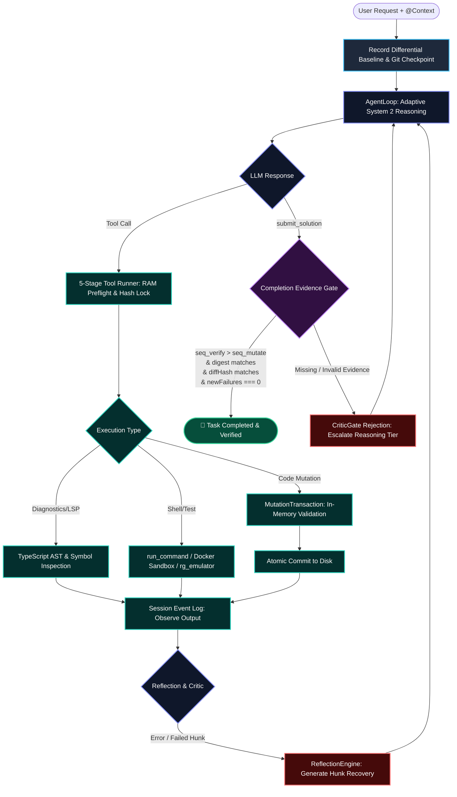

# ⚡ Minus CLI — Production-Grade Autonomous Coding Agent

**Minus CLI** (CodingAgent) là một hệ thống **Autonomous AI Coding Engine** cá nhân được phát triển bằng **TypeScript & Node.js**, xây dựng theo mô hình Microkernel kiến trúc phân tầng khép kín. 

Dự án loại bỏ hoàn toàn sự phụ thuộc vào các framework AI cồng kềnh (LangChain, CrewAI, AutoGen) để trực tiếp làm chủ:
- **Vòng lặp tương tác khép kín (Autonomous Agent Loop & Continuation Protocol)**
- **Kiến trúc đột phá "Surgical, Atomic & Evidence-Gated Mutation"** (Sửa đổi code vi phẫu, cô lập nguyên tử trên RAM, kiểm tra diff/hash SHA-256 trước khi ghi đĩa)
- **Hệ thống tư duy phản biện & tự sửa sai (Codex Reflection & Self-Critique Architecture)**
- **Native TypeScript Language Server & AST Analysis** (Kiểm tra kiểu dữ liệu, Symbol references & Blast radius phân tích tầm ảnh hưởng)
- **Tích hợp Multimodal Vision & Real-time Context Attachments (`@`)**
- **Cổng xác thực bằng chứng thời gian thực (Differential Baseline Verification & Completion Gate)**

---

## 🎯 Kiến Trúc Vận Hành Khép Kín (Closed-Loop Autonomous Architecture)

Minus CLI vận hành dựa trên một chu trình **OODA Loop (Observe – Orient – Decide – Act – Verify)** khép kín tuyệt đối. Mỗi thay đổi code hay hành động của Agent đều phải trải qua vòng kiểm soát nghiêm ngặt với cơ chế phản hồi hai chiều (Bidirectional Feedback Loop):

```text
                                        ┌────────────────────────┐
                                        │    USER / DEVELOPER    │
                                        └───────────┬────────────┘
                                                    │ Prompt + @Context Attachment
                                                    ▼
                                        ┌────────────────────────┐
                                        │  CLI REPL & UI Layer   │ (Slash Commands, Real-time Mentions,
                                        │      (cli-ui.ts)       │  Prompt Cache Telemetry & Spinners)
                                        └───────────┬────────────┘
                                                    │
                                                    ▼
 ┌────────────────────────────────────────────────────────────────────────────────────────────────────────┐
 │ 1. INTAKE & BASELINE SNAPSHOT (AgentKernel)                                                            │
 │  - Snapshot Baseline Failures (VerificationBaseline)  - Formulate Working Hypothesis (H1, H2)          │
 │  - Assemble KV-Cache Preserving System Prompt         - Initialize Shadow Git Checkpoint               │
 └──────────────────────────────────────────────────┬─────────────────────────────────────────────────────┘
                                                    │
                                                    ▼
 ┌────────────────────────────────────────────────────────────────────────────────────────────────────────┐
 │ 2. ADAPTIVE REASONING & ROUTING (AgentLoop)                                                            │
 │  - AdaptiveReasoningController (System 2 Thinking: Medium 8k ──► High 16k ──► Max 32k)                 │
 │  - FallbackRouter (Gemini 2.5 Flash ──► DeepSeek Reasoner ──► OpenAI-Compatible)                       │
 └──────────────────────────────────────────────────┬─────────────────────────────────────────────────────┘
                                                    │
                                                    ▼ Model Decision
                        ┌───────────────────────────┴───────────────────────────┐
                        │                                                       │
                 [Tool Call Action]                                    [submit_solution]
                        │                                                       │
                        ▼                                                       ▼
 ┌──────────────────────────────────────────────┐        ┌──────────────────────────────────────────────┐
 │ 3. 5-STAGE SURGICAL EXECUTION PIPELINE       │        │ 5. EVIDENCE-GATED COMPLETION GATE            │
 │  1. Schema & Parameter Validation            │        │  - CriticGate: Solution quality evaluation   │
 │  2. Security & Path Resolution (Jail check)  │        │  - Seq Check: seq_verify > seq_mutate        │
 │  3. Mutation Lock: Optimistic SHA-256 Hash   │        │  - Digest Check: workspaceDigest intact      │
 │  4. RAM Preflight (MutationTransaction)      │        │  - Diff Hash Check: diffHash matches test    │
 │  5. Execution Engine:                        │        │  - Baseline Check: (post - baseline) === 0   │
 │     ├─ Mutation: create/replace/patch/delete │        └──────────────────────┬───────────────────────┘
 │     ├─ TS LSP: diagnostics/symbols/refs/blast│                               │
 │     ├─ Execution: run_command / sandbox / rg │                 ┌─────────────┴─────────────┐
 │     └─ Multimodal: inspect_image             │                 ▼                           ▼
 └──────────────────────┬───────────────────────┘          [VERIFIED PASS]             [REJECTED]
                        │                                         │                           │
                        ▼                                         ▼                           │
 ┌──────────────────────────────────────────────┐       🏁 TASK COMPLETED                     │
 │ 4. OBSERVATION, REFLECTION & SELF-CRITIQUE   │     (Evidence Proven on Disk)               │
 │  - Append to Session Event Log (.jsonl)      │                                             │
 │  - Error/Hunk Diagnostics Extraction         │                                             │
 │  - ReflectionEngine: Synthesize fix prompt   │                                             │
 │  - HypothesisRollback: Clean slate on falsify│                                             │
 └──────────────────────┬───────────────────────┘                                             │
                        │                                                                     │
                        └───────────────────────────◄─────────────────────────────────────────┘
                                         (Next Iteration / Healing Loop)
```



### 🔁 Quy Trình 5 Giai Đoạn Vận Hành Chi Tiết:

1. **Giai đoạn 1: Tiếp nhận & Chụp Baseline (Intake & Baseline Snapshot):**
   - Tiếp nhận lệnh từ người dùng cùng ngữ cảnh đính kèm qua cơ chế `@file` / `@dir`.
   - `VerificationBaseline` chạy thử test suite để ghi nhận các lỗi đã tồn tại từ trước trong kho mã nguồn (pre-existing failures), tạo điểm mốc so sánh sai lệch.
   - `ShadowGitManager` thiết lập checkpoint an toàn nhằm sẵn sàng khôi phục khi cần thiết.

2. **Giai đoạn 2: Lập luận thích ứng & Điều hướng Model (Adaptive Reasoning & Routing):**
   - `AdaptiveReasoningController` tự động cấp phát ngân sách tư duy phù hợp: `8,192 tokens` cho tác vụ chuẩn, tự động nâng lên `16,384` hoặc `32,768 tokens` nếu gặp phản hồi từ chối từ Critic Gate.
   - `FallbackRouter` đảm bảo tính sẵn sàng cao, tự động chuyển mạch giữa Gemini 2.5 Flash, DeepSeek Reasoner hoặc OpenAI endpoints.

3. **Giai đoạn 3: Phê duyệt & Thực thi công cụ vi phẫu (Surgical Execution Pipeline):**
   - Mọi công cụ thay đổi tệp (`replace_text`, `apply_patch`, `delete_file`) đều bắt buộc xác thực mã băm SHA-256 (`expectedFileHash`) và kiểm tra số lần xuất hiện duy nhất (`expectedOccurrences: 1`).
   - `MutationTransaction` tiến hành preflight 100% trên bộ nhớ RAM; chỉ khi toàn bộ các hunk/file khớp hoàn hảo mới kích hoạt ghi đĩa nguyên tử.

4. **Giai đoạn 4: Quan sát, Tự phản tư & Tự sửa sai (Observation & Self-Critique):**
   - Kết quả thực thi được ghi nhận vào Event Log (JSONL).
   - Nếu phát hiện lỗi biên dịch hoặc lỗi patch (`PATCH_FAILED_HUNK`), `ReflectionEngine` tự động trích xuất ngữ cảnh dòng thực tế, sinh hướng dẫn khắc phục vi phẫu (Hunk Recovery Protocol) và tiếp tục vòng lặp (`Continuation Protocol`).

5. **Giai đoạn 5: Cổng thẩm định & Nghiệm thu bằng chứng (Evidence-Gated Completion):**
   - Agent bắt buộc phải gọi tool `submit_solution` đi kèm bằng chứng kiểm thử thực tế.
   - `CompletionEvidenceGate` đối chiếu 4 điều kiện bất biến: Thứ tự thời gian (`seq_verify > seq_mutate`), SHA Digest toàn vẹn của workspace, Khớp Diff Hash tại thời điểm chạy test và Số lượng lỗi phát sinh mới bằng 0 (`newFailures === 0`).


---

## 💎 Các Trụ Cột Đột Phá Cốt Lõi

### 1. Kiến Trúc Sửa Đổi Vi Phẫu & Bất Biến An Toàn (Surgical Mutation Pipeline)
- **Optimistic Locking via SHA-256 Hashes:** Mọi thao tác sửa đổi (`replace_text`, `apply_patch`, `delete_file`) đều yêu cầu `expectedFileHash`. Nếu nội dung file trên đĩa đã bị thay đổi bởi tiến trình khác, thao tác bị từ chối ngay lập tức với mã lỗi `STALE_FILE_HASH`.
- **Ambiguity Prevention:** `replace_text` mặc định yêu cầu `expectedOccurrences: 1`. Chống việc LLM chọn nhầm vị trí khi chuỗi cần thay thế xuất hiện nhiều lần.
- **Hierarchical Fuzz Patching:** `apply_patch` hỗ trợ 4 cấp độ matching:
  - `Fuzz 0`: Khớp chính xác 100% từng byte và dòng.
  - `Fuzz 1`: Bỏ qua sai lệch CRLF/LF và khoảng trắng thụt lề đầu dòng.
  - `Fuzz 2`: Rút gọn dòng context an toàn khi vùng thay đổi là duy nhất.
  - `Fuzz 3 (Advisory)`: Đạt độ tương đồng Levenshtein $\ge 80\%$, trả về gợi ý `FUZZY_CANDIDATE_FOUND` để Agent đọc lại vùng code thay vì ghi đè mù quáng.
- **In-Memory Preflight Transactions (`MutationTransaction`):** Thử nghiệm toàn bộ thay đổi (bao gồm cả multi-file patch) trên bộ nhớ RAM trước. Nếu có bất kỳ hunk/file nào thất bại, không có một byte rác nào bị ghi xuống đĩa.
- **Shadow Git Checkpoints & Rollback:** Tự động tạo snapshot trước mỗi task, cho phép rollback tức thì khi giả thuyết thất bại hoặc cạn ngân sách tự sửa lỗi.

---

### 2. Hệ Thống Tư Duy Phản Biện & Tự Sửa Sai (Codex Reflection Architecture)
- **`HypothesisTracker`:** Mô hình hoá các giả thuyết kỹ thuật (H1, H2,...) theo chu trình `formulated → testing → validated / falsified`. Tự động chèn cảnh báo cấm thử lại các giả thuyết đã bị bác bỏ.
- **`SpeculativeBranchManager`:** Tạo môi trường Git Worktree riêng biệt để Agent thử nghiệm các giải pháp rủi ro cao mà không ảnh hưởng đến working tree chính.
- **`AdaptiveReasoningController`:** Tự động điều chỉnh ngân sách tư duy (System 2 Thinking Tokens) theo các tầng:
  - `Tier Medium` (8,192 tokens) cho các bước bình thường.
  - `Tier High` (16,384 tokens) khi bị Critic từ chối lần đầu.
  - `Tier Max` (32,768 tokens) khi gặp bài toán hóc búa/phức tạp.
- **`CriticGate` & `AuditLedger`:** Cổng thẩm định nội bộ đánh giá giải pháp trước khi nộp, ghi nhận toàn bộ nhật ký kiểm toán không thể bị giả mạo.

---

### 3. Native TypeScript Language Server & AST Analysis
Tích hợp trực tiếp TypeScript Compiler API vào runtime của Agent:
- **`get_diagnostics`:** Lấy danh sách lỗi biên dịch thời gian thực (syntax & semantic errors) từ bộ nhớ.
- **`inspect_symbol`:** Tìm định nghĩa, kiểu dữ liệu, JSDoc và signature của bất kỳ hàm, biến, class hay type nào.
- **`find_references`:** Tìm kiếm mọi vị trí đang sử dụng một symbol trong toàn bộ codebase.
- **`blast_radius`:** Phân tích đồ thị phụ thuộc (dependency graph), cảnh báo vùng ảnh hưởng trước khi thực hiện xóa hoặc tái cấu trúc file/hàm trọng yếu.

---

### 4. Bằng Chứng Xác Thực & Hoàn Thành Nhiệm Vụ (Evidence-Gated Verification)
- **`submit_solution`:** Tool độc quyền thay thế cho việc LLM tự kết thúc một cách cảm tính. Bắt buộc cung cấp tóm tắt thay đổi và bằng chứng kiểm thử thực tế.
- **`CompletionEvidenceGate`:** Xác minh bằng chứng theo 3 ràng buộc bất biến:
  1. `seq_verify > seq_mutate`: Lệnh test bắt buộc phải chạy **sau** thao tác sửa code cuối cùng.
  2. `latestVerification.workspaceDigest === currentWorkspaceDigest`: Không có file nào bị thay đổi sau khi chạy test.
  3. `latestVerification.diffHash === currentDiffHash`: Khớp hash của `git diff` tại thời điểm kiểm thử.
- **Differential Baseline Verification:** Chụp baseline trước khi sửa code, đảm bảo công thức: `newFailures(post - baseline) === 0` (Bỏ qua các lỗi có sẵn từ trước trong repo của người dùng, nhưng nghiêm cấm sinh ra lỗi hồi quy mới).

---

### 5. Multimodal Vision & Real-time Context Attachments
- **`inspect_image`:** Tự động trích xuất MIME type, kích thước width/height của các định dạng ảnh (PNG, JPEG, WEBP, GIF, SVG) và chuyển đổi thành Multimodal Message Parts (inline base64 / OpenAI vision schema) để gửi trực tiếp cho LLM phân tích giao diện, UI/UX hoặc biểu đồ.
- **Real-time `@` Mentions:** Gõ `@` trên giao diện CLI để tự động tìm kiếm, gợi ý và đính kèm nội dung file hoặc cây thư mục vào câu lệnh với giao diện trực quan.
- **Zero-Dependency Built-in Ripgrep (`rg-emulator`):** Tìm kiếm biểu thức chính quy tốc độ cao trên toàn bộ workspace mà không yêu cầu máy chủ cài sẵn `ripgrep` hay `grep`.

---

### 6. Quản Lý Session Event-Sourced & Prompt Caching
- **Append-only Event Log:** Lưu trữ toàn bộ messages, tool calls, tool results, checkpoints dưới định dạng `.codingagent/sessions/*.jsonl`.
- **KV-Cache Preservation:** Tự động sắp xếp tool schemas theo thứ tự bảng chữ cái và giữ nguyên tiền tố tĩnh của System Prompt để tối đa hoá tỉ lệ Hit Rate của Prompt Cache (giảm tới 80% chi phí và độ trễ LLM API).
- **Hybrid Memory:** Kết hợp `ProjectMemoryManager` (lưu trữ insight, quy ước dự án) và `VectorMemory` (tìm kiếm vector ngữ nghĩa).

---

## 📂 Cấu Trúc Mã Nguồn (Project Structure)

```text
CodingAgent/
├── src/
│   ├── index.ts                             # CLI Entry Point & REPL Orchestrator
│   │
│   ├── agent/                               # Lõi điều phối Autonomous Agent
│   │   ├── agent-loop.ts                    # Agent Loop & Continuation Protocol
│   │   ├── adaptive-reasoning-controller.ts # Điều phối token suy nghĩ System 2
│   │   ├── critic-gate.ts                   # Thẩm định chất lượng giải pháp
│   │   ├── hypothesis-tracker.ts            # Theo dõi giả thuyết H1, H2,...
│   │   ├── hypothesis-rollback-orchestrator.ts # Tự động rollback khi sai giả thuyết
│   │   ├── speculative-branch-manager.ts    # Quản lý Git Worktrees cô lập
│   │   ├── completion-evidence.ts           # Cổng xác thực bằng chứng hoàn thành
│   │   ├── final-answer-guard.ts            # Chặn false-refusal và hallucinated completion
│   │   ├── reflection-engine.ts             # Tự động trích xuất chẩn đoán lỗi & self-heal
│   │   ├── audit-ledger.ts                  # Nhật ký kiểm toán bất biến
│   │   └── context-compactor.ts             # Nén ngữ cảnh bảo toàn thông tin quan trọng
│   │
│   ├── kernel/                              # Microkernel Architecture
│   │   ├── kernel.ts                        # AgentKernel trung tâm điều phối plugins
│   │   └── hooks.ts                         # Hook lifecycle events
│   │
│   ├── llm/                                 # Adapters & Prompt Engineering
│   │   ├── gemini.ts                        # Adapter Google Gemini API
│   │   ├── deepseek.ts                      # Adapter DeepSeek & OpenAI-compatible
│   │   ├── fallback-router.ts               # Điều phối failover giữa các nhà cung cấp LLM
│   │   ├── token-config.ts                  # Cấu hình Token budgets & Cache telemetry
│   │   └── prompts.ts                       # Static System Prompts bảo vệ KV-cache
│   │
│   ├── workspace/                           # Quản lý Workspace an toàn
│   │   ├── workspace.ts                     # Ranh giới an toàn, symlink jail & path resolution
│   │   ├── mutation-transaction.ts          # Giao dịch sửa file vi phẫu trên RAM
│   │   ├── workspace-digest.ts              # Tính toán SHA digest toàn vẹn workspace
│   │   ├── workspace-state-verifier.ts      # Kiểm tra độ sạch & diff hash của Git
│   │   ├── checkpoint.ts                    # Shadow Git Checkpoint Manager
│   │   └── file-attachment.ts               # Bộ phân giải context đính kèm (@)
│   │
│   ├── tools/                               # Danh bạ công cụ đa năng
│   │   ├── registry.ts                      # Tool Registry & JSON schema generators
│   │   ├── tool-runner.ts                   # 5-Stage validation & execution pipeline
│   │   ├── create-file.ts                   # Tool tạo file mới (Create-only semantics)
│   │   ├── replace-text.ts                  # Tool thay thế đoạn mã có kiểm tra Hash/Ambiguity
│   │   ├── apply-patch.ts                   # Tool vá file theo patch đa cấp Fuzz (0-3)
│   │   ├── delete-file.ts                   # Tool xóa file có kiểm tra Blast Radius
│   │   ├── move-file.ts                     # Tool di chuyển / đổi tên file an toàn
│   │   ├── read-file.ts                     # Tool đọc file với line-range & SHA-256
│   │   ├── run-command.ts                   # Tool thực thi lệnh CLI có sandbox/timeout
│   │   ├── submit-solution.ts               # Tool nộp kết quả kèm bằng chứng xác thực
│   │   ├── typescript-service.ts            # Native TS Compiler & Language Service
│   │   ├── get-diagnostics.ts               # Tool kiểm tra lỗi TS AST thời gian thực
│   │   ├── inspect-symbol.ts                # Tool tra cứu định nghĩa & kiểu của Symbol
│   │   ├── find-references.ts               # Tool tìm kiếm mọi tham chiếu của Symbol
│   │   ├── blast-radius.ts                  # Tool đo lường tầm ảnh hưởng thay đổi
│   │   ├── inspect-image.ts                 # Tool phân tích ảnh Multimodal Vision
│   │   ├── rg-emulator.ts                   # Zero-dependency Regex Search Engine
│   │   └── plan-tools.ts                    # Tool lập kế hoạch từng bước
│   │
│   ├── memory/                              # Bộ nhớ & Lưu trữ tri thức
│   │   ├── project-memory.ts                # Bộ nhớ quy ước dự án có scope & provenance
│   │   └── vector-memory.ts                 # Semantic Vector Search Engine
│   │
│   ├── session/                             # Quản lý phiên làm việc Event-Sourced
│   │   ├── session.ts                       # Event-sourced state & projection
│   │   └── persistent-session.ts            # JSONL storage & checkpoint resumption
│   │
│   ├── skills/                              # Quản lý kỹ năng & Chính sách xác thực
│   │   ├── verification-baseline.ts         # Differential Baseline Tester
│   │   └── verification-policy.ts           # Ràng buộc Verification-Before-Completion
│   │
│   ├── sandbox/                             # Môi trường cô lập thực thi
│   │   └── docker-sandbox.ts                # Docker Sandbox Manager & Host Fallback
│   │
│   ├── ui/                                  # Giao diện dòng lệnh REPL
│   │   └── cli-ui.ts                        # Render hộp thoại, màu sắc, spinners & stats
│   │
│   └── test-suite.ts                        # Bộ kiểm thử toàn diện với 617 test cases
│
├── package.json
├── tsconfig.json
└── CURRENT_MUTATION_INVARIANTS.md           # Đặc tả các bất biến an toàn đột phá
```

---

## 🛠️ Hướng Dẫn Cài Đặt & Sử Dụng

### 1. Yêu cầu môi trường
- **Node.js**: $\ge 18.0.0$
- **NPM** hoặc **pnpm** / **yarn**

### 2. Cài đặt dependencies
```bash
npm install
```

### 3. Cấu hình biến môi trường (`.env`)
Tạo file `.env` tại thư mục gốc với các khoá API mong muốn:
```env
# Gemini API Key (mặc định)
GEMINI_API_KEY=AIzaSy...
GEMINI_MODEL=gemini-2.5-flash

# DeepSeek / OpenAI API Key (tùy chọn)
DEEPSEEK_API_KEY=sk-...
OPENAI_API_KEY=sk-...
```

### 4. Biên dịch dự án
```bash
npm run build
```

### 5. Chạy bộ kiểm thử (Unit & Integration Tests)
Kiểm tra toàn diện 30 hạng mục kiến trúc (617 assertions):
```bash
npm test
```

### 6. Khởi chạy Minus CLI tương tác
```bash
npm run dev
```

---

## ⌨️ Các Lệnh Điều Khiển CLI (Interactive Commands)

Trong giao diện tương tác của Minus CLI, bạn có thể sử dụng các lệnh đặc biệt:
- `/plan`: Xem hoặc cập nhật kế hoạch thực thi công việc hiện tại.
- `/clear`: Làm mới ngữ cảnh hội thoại của session hiện tại.
- `/session`: Xem chi tiết thống kê và lịch sử sự kiện của session đang chạy.
- `/sessions`: Liệt kê tất cả các phiên làm việc đã lưu trữ trên đĩa.
- `@<file_path>`: Gõ `@` để kích hoạt gợi ý và đính kèm ngữ cảnh file/thư mục tự động.
- `/help`: Xem danh sách tất cả các lệnh hỗ trợ.

---

## 🛡️ Cam Kết Bất Biến (Guarantees)

1. **Zero Hallucinated Completion:** Không bao giờ chấp nhận nhiệm vụ hoàn thành nếu không có bằng chứng test thực tế sau lần sửa đổi code cuối cùng.
2. **Zero Disk Pollution on Failure:** Mọi lỗi vá file hoặc xung đột code đều bị chặn ở tầng RAM, giữ cho workspace luôn ở trạng thái sạch.
3. **Optimistic Concurrency Protection:** Bảo vệ chống xung đột tệp tin tuyệt đối bằng hàm băm SHA-256 trước và sau mỗi thao tác.
4. **Adaptive Context & Prompt Caching:** Tối ưu hoá chi phí vận hành và tốc độ phản hồi qua cơ chế bảo tồn KV-Cache.
