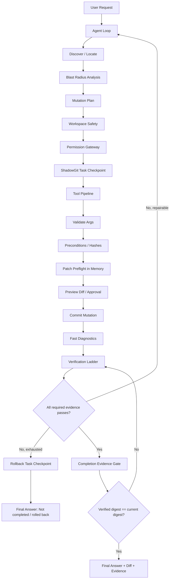
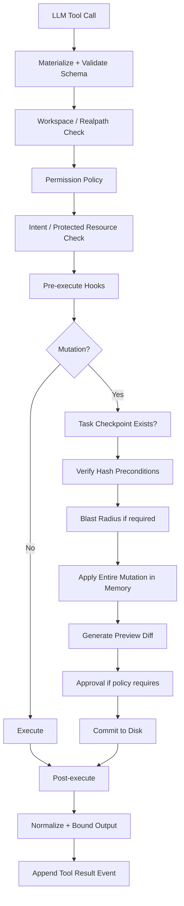

# Kế hoạch nâng cấp Workflow CRUD/Read cho CodingAgent theo kiến trúc “Surgical, Atomic, Evidence-Gated”

## Tóm tắt điều hành

Kiến trúc hiện tại của bạn đã có nền móng tốt: thao tác đọc chuyên biệt, `apply_patch`/`replace_text` thay cho ghi đè mù, kiểm tra workspace, snapshot bằng `ShadowGitManager`, verification bắt buộc và `CompletionEvidenceGate`. Hướng này cũng tương đồng với các nguyên tắc mà DeepSeek Harness hiện dùng: tool call đi qua một pipeline có `pre-execute → execute → post-execute → result`, session là append-only source of truth, còn policy/sandbox được đặt ở các capability seam thay vì nhét hết logic vào Agent Loop. citeturn5search1turn6search3turn6search6

Tuy nhiên, để nâng từ **“Agent sửa file khá an toàn”** thành **“Coding Agent phẫu thuật mã nguồn có khả năng tự chứng minh thay đổi của mình không gây regression đã biết”**, tôi khuyến nghị thêm bốn năng lực còn thiếu:

1. **Semantic location & blast-radius analysis** trước mutation: không chỉ `grep`, mà hiểu symbol, reference, interface implementation, caller/callee và dependency. TypeScript Language Service đã được thiết kế cho các thao tác editor dài hạn như rename/refactoring và quản lý dependency graph; LSP cũng chuẩn hóa các thao tác definition/reference/rename/call hierarchy. citeturn4search3turn4search5turn4search0
2. **Transaction envelope cấp task**, thay vì hiểu “atomic” chỉ ở từng `apply_patch`: mọi mutation trong một task phải gắn với `taskCheckpoint`, workspace digest, precondition và rollback policy.
3. **Verification theo bằng chứng trạng thái**, không chỉ `seq_verify > seq_mutate`: kết quả verification phải được ràng buộc với chính `workspaceDigest/diffHash` đã được verify.
4. **Differential verification**: phải biết repository đã lỗi trước hay Agent vừa tạo ra lỗi. Nếu baseline xanh, hậu mutation phải xanh; nếu baseline đã đỏ, Agent không được tạo thêm failure mới và phải công khai baseline failure.

Điểm quan trọng nhất: tôn chỉ **“Hoàn Thành Task Không Gây Ra Lỗi Code” không thể được chứng minh tuyệt đối** chỉ bằng `tsc + npm test`; test suite không bao phủ mọi hành vi runtime. Điều hệ thống có thể bảo đảm một cách kỹ thuật là:

> **Không phát Final Answer ở trạng thái SUCCESS nếu thay đổi hiện tại chưa vượt qua VerificationPolicy bắt buộc và chưa có bằng chứng rằng workspace được verify chính là workspace hiện tại. Nếu verification thất bại và Agent không sửa được trong budget, rollback về task checkpoint thay vì để workspace ở trạng thái hỏng.**

Đây là invariant nên biến thành code, không chỉ để trong system prompt.

### Kiến trúc mục tiêu



Điểm nâng cấp kiến trúc lớn nhất là **Final Answer không còn được quyết định chỉ bởi LLM**. LLM có thể nói “xong”, nhưng runtime mới là thành phần có quyền chuyển task sang `COMPLETED_VERIFIED`.

---

## Hiện trạng và các khoảng trống cần xử lý

Phần inventory dưới đây dựa trên **mô tả của bạn**, chưa phải audit source code thực tế. Các chi tiết chưa được cung cấp được đánh dấu **Chưa xác định**.

| Thành phần hiện tại | Vai trò | Đánh giá |
|---|---|---|
| `read-file.ts` | Đọc theo `offset/limit`, line numbers, `contentHash` | Giữ; đây là primitive rất tốt cho optimistic locking |
| `search-codebase-fast.ts` | Text/regex search | Giữ; dùng cho discovery nhanh |
| `list-files.ts` | Duyệt workspace, bỏ `node_modules/.git/dist/build` | Giữ; nên thống nhất ignore engine |
| `read-compressed-code.ts` | Repomix compressed overview | Giữ, nhưng chỉ dùng để hiểu architecture, không làm source of truth cho mutation |
| `write-file.ts` | Create file và parent dirs | Nên đổi semantics thành `create_only` mặc định |
| `apply-patch.ts` | Unified patch, multi-file transaction, Fuzz 0–3 | Giữ nhưng siết fuzzy mutation |
| `replace-text.ts` | Exact block replacement + `expectedFileHash` | Giữ; mở rộng `expectedOccurrences` |
| `git-tools.ts` | `git rm`, `git clean`, Git utilities | Thu hẹp quyền mutation trực tiếp |
| `workspace.ts` | Path traversal/protected files | Tăng cường chống symlink escape |
| `shadow-git.ts` | Snapshot/undo | Nâng từ mutation checkpoint lên task transaction checkpoint |
| `verification-policy.ts` | `tsc/test/build` | Nâng thành verification ladder + baseline comparison |
| `CompletionEvidenceGate` | `seq_verify > seq_mutate` | Nâng lên evidence binding theo workspace digest |
| Agent Loop | Tool orchestration | Nên giữ nhỏ; không đưa logic patch/safety/verification chi tiết vào loop |
| Session/Event system | Chưa mô tả đầy đủ trong request này | Cần append-only evidence events |
| OS sandbox | **Chưa xác định** | Cần abstraction riêng |
| TypeScript Language Service/LSP | **Chưa có theo mô tả** | Năng lực mới ưu tiên cao |
| Baseline verification cache | **Chưa xác định** | Nên thêm |
| Command allowlist | **Chưa xác định** | Bắt buộc trước khi mở rộng `run_command` |

### Điểm mạnh hiện tại

`expectedFileHash` của `replace_text` là một thiết kế rất đúng hướng: nó biến mutation từ “hãy sửa text tôi nhớ” thành “hãy sửa **đúng version file mà tôi đã quan sát**”. TypeScript Language Service cũng dùng khái niệm snapshot/version của input để xử lý incremental state; đây là một pattern phù hợp cho CodingAgent. citeturn4search3

`read-compressed-code` dựa trên Repomix cũng hợp lý cho bước định hướng repository: Repomix hỗ trợ token counting, include/ignore và compression bằng Tree-sitter để giữ lại các cấu trúc như function signature, interface và class trong khi bỏ bớt implementation. Nhưng chính tài liệu Repomix gọi compression là experimental, vì vậy compressed representation không nên được dùng làm bằng chứng cuối cùng trước mutation; Agent phải quay lại `read_file`/semantic tools lấy source thật. citeturn7search0turn7search3turn7search5

### Hai vấn đề kiến trúc cần sửa sớm

**Thứ nhất, “multi-file atomic” cần định nghĩa lại chính xác.** Việc apply toàn bộ hunks lên buffer trong RAM trước khi ghi disk rất tốt vì loại bỏ partial hunk application. Nhưng một loạt ghi nhiều file xuống filesystem không phải một transaction filesystem nguyên tử theo nghĩa ACID. POSIX `rename()` cho phép replacement nguyên tử của một pathname, nhưng không biến nhiều rename thành một transaction duy nhất; Node cũng cảnh báo về các thao tác write chồng lấn không được tuần tự hóa. Vì vậy nên gọi kiến trúc hiện tại là **“preflight-atomic + compensating rollback”**, không phải “filesystem-atomic multi-file transaction”. citeturn2search1turn2search0

**Thứ hai, Fuzz 3 không nên có quyền auto-commit.** Git có `git apply --check` để kiểm tra patch có áp dụng được trước khi mutate, mặc định từ chối unsafe paths và có `--3way` khi có blob ancestry phù hợp; cách tiếp cận này ưu tiên precondition rõ ràng thay vì approximate text similarity. Vì vậy mức Levenshtein ≥80% nên được biến thành **locator/advisory mode**: báo cho LLM “có candidate gần giống”, sau đó bắt Agent đọc lại file và tạo patch mới; không dùng Fuzz 3 trực tiếp thay đổi source. Đây là khuyến nghị kiến trúc của tôi dựa trên nguyên tắc fail-closed, không phải yêu cầu của Git. citeturn2search23turn1search5turn1search0

### Chính sách Fuzz mục tiêu

| Fuzz | Hiện tại | Đề xuất |
|---|---|---|
| `0` | Exact + line offset | **Auto-apply được** nếu hash/precondition đúng |
| `1` | Whitespace/CRLF/indent normalization | Auto-apply có điều kiện; log `fuzzUsed=1` |
| `2` | Giảm context | Chỉ auto-apply nếu target là duy nhất + file hash hợp lệ |
| `3` | Levenshtein ≥80% | **Không mutate**; trả `FUZZY_CANDIDATE_FOUND`, bắt buộc re-read/re-plan |

Git cũng có cơ chế kiểm tra whitespace khi apply/diff, do đó `git diff --check` nên trở thành một cheap verification gate, nhưng chỉ để phát hiện một lớp vấn đề whitespace chứ không thay thế compiler/tests. citeturn2search26turn2search8

---

## Kiến trúc mục tiêu và bộ công cụ nâng cấp

Tôi đề xuất giữ triết lý **specialized coding tools**, không biến toàn bộ hệ thống thành một shell agent. Gemini function calling vốn được thiết kế theo flow: model chọn function và arguments, ứng dụng mới là bên thực thi, rồi tool result được gửi lại cho model; Gemini cũng hỗ trợ compositional/multi-step function calling. Vì vậy policy, hash checks, sandbox và transaction semantics phải nằm trong runtime, không được phụ thuộc vào việc “LLM nhớ làm đúng”. citeturn0search3turn0search18

### Bộ tool mục tiêu

Bốn tool đọc hiện tại vẫn giữ. Nên thêm/nâng các tool sau:

| Tool | Mục đích | Mức rủi ro |
|---|---|---:|
| `read_file` | Source-of-truth read + hash + ranges | Thấp |
| `list_files` | Workspace discovery | Thấp |
| `search_codebase_fast` | Lexical search | Thấp |
| `read_compressed_code` | Architecture overview tiết kiệm context | Thấp |
| **`inspect_symbol`** | Definition/type/signature/export metadata | Thấp |
| **`find_references`** | Semantic references thay cho grep thuần | Thấp |
| **`analyze_impact`** | Blast-radius report | Thấp |
| `create_file` | Create-only, không overwrite | Trung bình |
| `replace_text` | Surgical exact mutation | Trung bình |
| `apply_patch` | Multi-file patch | Trung bình/Cao |
| **`delete_file`** | Dedicated deletion với hash + intent | Cao |
| **`move_file`** | Move/rename path an toàn | Cao |
| **`rename_symbol`** | Semantic symbol rename | Cao; phase sau |
| **`get_diagnostics`** | TS syntactic/semantic diagnostics | Thấp |
| **`get_workspace_diff`** | Machine-readable diff/evidence | Thấp |
| **`run_command`** | Build/test/lint/git read operations | Cao |

TypeScript Language Service là lựa chọn ưu tiên cho repository TypeScript/JavaScript vì nó duy trì một compilation context dài hạn, hỗ trợ editor/refactoring operations và dependency resolution. Nếu sau này CodingAgent trở thành multi-language, abstraction nên đặt theo LSP để tận dụng definition/references/rename/call hierarchy của từng language server; Tree-sitter phù hợp cho structural fallback nhưng không thay thế type-aware reference resolution. citeturn4search3turn4search5turn4search2turn4search0

### Contract đề xuất cho các tool quan trọng

#### `create_file`

```json
{
  "path": "src/auth/auth-errors.ts",
  "content": "...",
  "expectedAbsent": true
}
```

Output:

```json
{
  "ok": true,
  "path": "src/auth/auth-errors.ts",
  "created": true,
  "bytes": 412,
  "contentHash": "sha256:..."
}
```

Safety invariants:

```text
expectedAbsent phải là true mặc định
existing file => FILE_ALREADY_EXISTS
workspace containment
protected-path check
parent symlink check
snapshot trước disk commit
```

`write_file` cũ nên alias sang `create_file` hoặc đổi default thành **không bao giờ overwrite file đã tồn tại**. Update phải qua `replace_text`/`apply_patch`.

#### `apply_patch`

Input:

```json
{
  "patch": "...unified diff...",
  "expectedFileHashes": {
    "src/auth.ts": "sha256:..."
  }
}
```

Output:

```json
{
  "ok": true,
  "transactionId": "mut_123",
  "changedFiles": [
    {
      "path": "src/auth.ts",
      "operation": "update",
      "beforeHash": "sha256:...",
      "afterHash": "sha256:..."
    }
  ],
  "fuzzUsed": 0,
  "diffHash": "sha256:..."
}
```

Internal runtime phải thực hiện `parse → path validate → hash validate → in-memory apply → full patch validation → preview → permission → disk commit`. `git apply --check` là một reference pattern hữu ích cho “check before apply”; Git cũng từ chối patch chạm ra ngoài work area theo mặc định. citeturn2search23turn1search0

#### `replace_text`

Nên mở rộng input hiện tại:

```json
{
  "path": "src/auth.ts",
  "oldText": "...",
  "newText": "...",
  "expectedFileHash": "sha256:...",
  "expectedOccurrences": 1
}
```

Nếu tìm thấy `0` hoặc `>1` occurrences:

```json
{
  "ok": false,
  "code": "AMBIGUOUS_REPLACEMENT",
  "actualOccurrences": 3
}
```

Không cho LLM chọn “thay đại occurrence đầu tiên”.

#### `delete_file`

```json
{
  "path": "src/legacy-auth.ts",
  "expectedFileHash": "sha256:...",
  "reason": "User requested removal of legacy auth implementation"
}
```

Output:

```json
{
  "ok": true,
  "deleted": true,
  "path": "src/legacy-auth.ts",
  "previousHash": "sha256:..."
}
```

Trước deletion:

```text
semantic references == checked
blast-radius == generated
protected == false
hash == expected
destructive intent == satisfied
task snapshot == available
```

Không nên dùng `git clean` làm primitive xóa file thông thường. `git status --porcelain` có output được thiết kế ổn định cho scripts, còn dedicated `delete_file` cho phép hệ thống enforce workspace/hash/intent một cách rõ ràng hơn. citeturn1search1

#### `analyze_impact`

```json
{
  "path": "src/services/user-service.ts",
  "symbol": "findUser",
  "scope": "workspace",
  "depth": 2
}
```

Output:

```json
{
  "risk": "HIGH",
  "definition": {
    "path": "src/services/user-service.ts",
    "line": 41
  },
  "directReferences": 12,
  "callers": 5,
  "implementations": 2,
  "dependentFiles": [
    "src/controllers/auth.ts",
    "src/controllers/users.ts"
  ],
  "relatedTests": [
    "tests/auth.test.ts"
  ],
  "publicApiAffected": true,
  "warnings": [
    "Exported function signature may change"
  ]
}
```

#### `run_command`

Không nên nhận một shell string tự do như:

```text
"npm test && rm ..."
```

Nên nhận cấu trúc:

```json
{
  "program": "npm",
  "args": ["test", "--", "--runInBand"],
  "cwd": ".",
  "timeoutMs": 120000,
  "purpose": "verification"
}
```

Node `child_process.spawn()`/`execFile()` có thể chạy command mà không cần shell; Node cảnh báo rõ rằng khi bật shell thì input không được sanitize có thể dẫn tới arbitrary command execution. API cũng hỗ trợ `cwd`, timeout và `AbortSignal`. Vì vậy `shell:false` nên là default bất biến của `run_command`; shell script phức tạp phải đi qua một permission tier cao hơn. citeturn1search2

### Specialized tool hay generic shell?

```text
read_file      > cat
list_files     > ls
find_references > grep
delete_file    > rm
get_diff       > arbitrary git command
```

Generic `run_command` vẫn cần cho compiler/test/build, nhưng **không nên là con đường mặc định cho file CRUD**. Specialized tools cho output có cấu trúc, path enforcement, optimistic concurrency và audit trail tốt hơn.

---

## Giao dịch an toàn, Blast Radius và Verification Evidence Gate

Đây là phần quan trọng nhất của roadmap.

### Pipeline thực thi tool mới

DeepSeek Harness hiện có pipeline tool với các seam `tools/pre-execute`, execution wrapper và `tools/post-execute`, sau đó phát authoritative result; thiết kế runtime của Harness cũng nhấn mạnh việc materialize arguments một lần trước khi các listener/policy xử lý. Đây là reference architecture tốt để áp dụng ở mức nhỏ hơn vào CodingAgent của bạn. citeturn6search6turn6search9



Agent Loop chỉ nên thấy:

```ts
const result = await toolRunner.execute(toolCall, context);
```

Các bước safety phía trên thuộc `ToolRunner`/policy services, không thuộc Agent Loop.

### Nâng ShadowGit từ “undo” thành transaction backbone

Nên có hai checkpoint:

```text
TURN/TASK START
    ↓
TaskCheckpoint #T
    ↓
mutation 1
mutation 2
repair mutation
    ↓
verification
```

và optional:

```text
MutationCheckpoint #T.1
MutationCheckpoint #T.2
```

Khi task thành công, giữ lịch sử phục vụ `/undo`.

Khi Agent cạn repair budget:

```text
rollback(TaskCheckpoint #T)
```

chứ không rollback chỉ mutation cuối.

Một phase cao hơn có thể thêm **Verified Shadow Worktree**. Git chính thức hỗ trợ linked worktree tạm ở detached HEAD và mô tả đây là cách tiện dụng để thử nghiệm/thực hiện testing mà không làm xáo trộn working tree chính. Nếu `ShadowGitManager` tạo được snapshot commit đầy đủ của trạng thái user, Agent có thể tạo throwaway worktree từ snapshot, apply + verify ở đó, rồi chỉ promote verified diff về workspace thật. citeturn11search0

Flow strict mode:

```mermaid
sequenceDiagram
    actor User
    participant Loop as AgentLoop
    participant Shadow as ShadowGitManager
    participant Sandbox as Verified Worktree
    participant Tools as Mutation Tools
    participant Verify as VerificationPolicy
    participant Main as User Workspace

    User->>Loop: Modify code
    Loop->>Shadow: Capture complete task snapshot
    Shadow->>Sandbox: Create isolated worktree from snapshot
    Loop->>Tools: Apply mutation in Sandbox
    Tools-->>Loop: Candidate diff
    Loop->>Verify: Typecheck/Test/Build in Sandbox

    alt PASS
        Verify-->>Loop: Verified evidence + diffHash
        Loop->>Main: Promote exact verified diff
        Loop->>Verify: Cheap post-promotion digest/check
        Loop-->>User: Final success
    else FAIL
        Verify-->>Loop: Failure evidence
        Loop->>Tools: Repair or abandon
        Loop-->>User: No broken candidate promoted
    end
```

Điều này cần benchmark trước vì worktree/dependency setup có cost; nếu `node_modules` không được chia sẻ an toàn hoặc workspace có untracked state phức tạp, implementation chi tiết vẫn **chưa xác định**.

### Blast Radius Impact Analysis

Blast radius không nên là một warning cosmetic; nó phải ảnh hưởng trực tiếp tới VerificationPolicy.

Đề xuất ba tầng:

| Tầng | Cơ chế | Khi dùng |
|---|---|---|
| Fast | lexical search + import graph | mọi mutation |
| Semantic | TS Language Service references/definitions/implementations | function/interface/export/rename/delete |
| Behavioral | callers, dependent modules, related tests, package boundaries | high-risk/public API |

TypeScript Language Service quản lý dependency graph và hỗ trợ incremental syntax/semantic diagnostics; TSConfig cũng cho biết TypeScript có thể cần load project references để thực hiện các thao tác graph-wide như Find All References. citeturn4search3turn2search6

Policy ví dụ:

```text
local function body change
→ MEDIUM
→ typecheck + targeted tests

private function signature change, 2 callers
→ MEDIUM/HIGH
→ references + typecheck + caller tests

exported interface change, 27 references, 3 packages
→ HIGH
→ explicit impact warning
→ full typecheck/build + relevant/full test suite

delete exported file/symbol
→ CRITICAL
→ mandatory reference scan + approval + full verification
```

Sau mutation, semantic analysis nên chạy lại để bắt các dangling reference mà pre-analysis không dự đoán được.

### Verification ladder

Không nên gọi `npm test`, `tsc`, `npm run build` cứng cho mọi repository. TypeScript `tsc` sử dụng project gần nhất có `tsconfig.json`; với project references, `tsc -b` là build mode được TypeScript cung cấp để xử lý graph nhiều project. Verification planner nên inspect manifest/`tsconfig`/scripts trước rồi lập plan. citeturn2search3turn2search12

Đối với hệ thống TypeScript/Node hiện tại, default policy có thể là:

| Gate | Kiểm tra | Timeout khuyến nghị | Failure |
|---|---|---:|---|
| Structural | mutation preconditions + protected paths | 5s | Hard fail |
| Diff | `git diff --check` | 10s | Hard fail |
| Diagnostics | changed-file syntactic/semantic diagnostics | 20–30s | Hard fail nếu lỗi mới |
| Type | `tsc --noEmit` hoặc configured `tsc -b` | 60–120s | Hard fail |
| Tests | targeted/relevant tests | 120s | Hard fail |
| Full tests | theo risk/policy | 300s | Hard fail |
| Build | configured build script | 300s | Hard fail |
| Final status | diff/status + unexpected files | 10s | Hard fail |

Các timeout trên là **giá trị đề xuất**, cần đo benchmark thực tế.

`git status --porcelain=v2 -z` phù hợp để lấy trạng thái machine-readable; Git đảm bảo porcelain format ổn định cho scripting và đề xuất NUL-delimited format để xử lý path an toàn. citeturn1search1

### Baseline differential verification

Đây là upgrade tôi đánh giá quan trọng hơn việc thêm nhiều tool.

Trước mutation đầu tiên:

```text
Baseline:
tsc -> PASS
tests -> 1 pre-existing failure
```

Sau mutation:

```text
Post:
tsc -> PASS
tests -> same 1 failure
```

Nếu policy hiện tại bắt buộc “mọi command exit 0”, một repo đã hỏng sẵn sẽ khiến Agent không bao giờ hoàn thành task không liên quan. Nên có hai mode:

**Strict-green mode**

```text
baseline must be green
post must be green
```

**Differential mode**

```text
newFailures(post - baseline) == 0
```

Nếu baseline đỏ, Final Answer phải nói rõ:

> Task không tạo failure mới theo verification đã chạy; repository vốn đã có N failure trước mutation.

Baseline có thể cache theo:

```text
workspaceDigest
toolchainFingerprint
verificationPolicyVersion
```

Khi digest thay đổi, cache mất hiệu lực.

### CompletionEvidenceGate mới

Thay:

```text
seq_verify > seq_mutate
```

bằng:

```text
latestVerification.workspaceDigest
    === currentWorkspaceDigest

AND latestVerification.diffHash
    === currentDiffHash

AND latestVerification.policyVersion
    === activePolicyVersion

AND latestVerification.requiredChecks.every(PASS)

AND unexpectedChangedFiles.length === 0
```

Điều này đóng một lỗ hổng quan trọng:

```text
mutation
→ verify PASS
→ mutation khác
→ Final Answer
```

Một sequence check tốt có thể bắt trường hợp trên, nhưng binding theo digest mạnh hơn vì bằng chứng được gắn trực tiếp với trạng thái source đã kiểm tra.

### Retry và rollback

Không retry test fail một cách mù quáng.

```text
Verification failure
    ↓
Is evidence actionable?
    ↓
YES → Agent reads failure
      → mutation repair
      → new verification
```

Tôi đề xuất:

```text
maxRepairCycles = 3
```

tách biệt với `maxSteps`.

Cùng một test fail có thể retry đúng **một lần** nếu policy phân loại là potential transient/flaky; nếu pass lần hai, Final Answer phải đánh dấu `flakyObserved=true`, không giả vờ như chưa từng fail.

Khi cạn repair budget:

```text
rollback task checkpoint
→ verify rollback state digest
→ task status = FAILED_ROLLED_BACK
```

---

## Session, Event, bảo mật, context budget và observability

DeepSeek Harness hiện xem append-only session event log là source of truth; history gửi model được derive từ log, và các session events là durable facts cần sống qua reload. Đây là pattern đặc biệt phù hợp với coding workflow vì mutation/verification cần audit và replay được. citeturn6search3turn6search4turn6search17

### Event schema cần bổ sung

Không lưu private chain-of-thought. Chỉ lưu observable action/evidence.

```text
turn/start
task/goal

step/start

tool/requested
tool/validated
permission/decision

workspace/baseline
blast-radius/result

snapshot/created

mutation/preflight
mutation/preview
mutation/applied

verification/start
verification/result

mutation/rollback

approval/requested
approval/resolved

assistant/message
task/completed
turn/end
```

Mỗi event nên có envelope:

```ts
interface AgentEventEnvelope<T> {
  id: string;
  seq: number;
  timestamp: string;

  sessionId: string;
  turnId: string;
  stepId?: string;
  toolCallId?: string;

  type: string;
  data: T;

  workspaceDigestBefore?: string;
  workspaceDigestAfter?: string;
}
```

Gemini 3 function calls trả về call ID để ứng dụng correlation function request/result, nên giữ `providerToolCallId` cùng internal `toolCallId` sẽ giúp replay/debug tốt hơn. citeturn0search18

### Output lớn không được nhét hết vào LLM context

Command runner có thể sinh megabytes log. Node có timeout/`maxBuffer` ở một số child-process APIs; CodingAgent nên chủ động đặt output budget thay vì dựa vào default implementation. citeturn1search2

Khuyến nghị:

```text
stdout model-visible: ≤ 128 KB
stderr model-visible: ≤ 128 KB
```

Khi vượt:

```json
{
  "truncated": true,
  "firstBytes": "...",
  "lastBytes": "...",
  "artifactId": "artifact_123",
  "fullOutputHash": "sha256:..."
}
```

Ưu tiên giữ **cuối output** cho compiler/test vì stack trace và summary thường nằm phía cuối, nhưng giữ cả prefix để Agent nhận biết command/framework.

### Chiến lược context/token

Không nên:

```text
read entire repository
→ send entire repository every step
```

Nên dùng funnel:

```text
list/search
      ↓
compressed architecture overview
      ↓
semantic symbol/reference lookup
      ↓
line-range read
      ↓
exact source around mutation
```

Repomix hỗ trợ include/ignore, token-count tree và token budget; compression giữ structural elements nhưng loại bỏ implementation details. Do đó workflow hợp lý là dùng compressed output cho **navigation**, rồi dùng `read_file`/Language Service cho **evidence**. citeturn7search0turn7search5turn7search7

Context policy:

```text
read_file default: 200–400 lines
search max: 50 matches
blast radius model summary: top 20 direct refs + aggregate counts
full detailed impact: artifact
command output: bounded
Repomix: include only relevant subtrees after initial architecture scan
```

### Ignore policy

Repomix đã hỗ trợ `.gitignore`, `.ignore`, `.repomixignore` và default build-directory patterns. Đối với file discovery riêng của Agent, thay vì tái implement toàn bộ semantics `.gitignore`, có thể dùng Git làm source-of-truth khi repository là Git: `git check-ignore --stdin -z`; Git document rõ command này kiểm tra path theo exclude mechanism và cung cấp NUL-delimited machine format. citeturn7search1turn9view0

Default hard ignores vẫn nên có:

```text
.git/
node_modules/
dist/
build/
coverage/
.cache/
.tmp/
```

Nhưng **không nên ignore blindly** một file user trực tiếp yêu cầu đọc.

### Workspace boundary phải chống cả symlink escape

Chỉ kiểm tra:

```ts
resolvedPath.startsWith(workspaceRoot)
```

là chưa đủ nếu:

```text
workspace/link -> /outside
```

Node `lstat()` cho phép nhận biết symbolic link, còn `realpath`/filesystem primitives có thể dùng để kiểm tra canonical destination. Node cũng expose `O_NOFOLLOW` trên các platform hỗ trợ để không follow symlink khi mở file. citeturn7search2

Policy nên là:

```text
READ:
resolve lexical path
→ inspect symlink chain
→ resolve real target
→ target must remain inside workspace

CREATE:
validate nearest existing parent realpath
→ parent must remain inside workspace

WRITE/DELETE:
reject protected symlink target
→ hash exact target
```

### Permission model

Giữ bốn mức nếu hệ thống hiện đã có bốn mode; chi tiết mode cụ thể hiện **chưa xác định**.

Một policy thực tế:

| Capability | Default |
|---|---|
| read/list/search/semantic analysis | Allow |
| diagnostics/git status/diff | Allow |
| exact patch inside workspace | Allow hoặc Ask tùy mode |
| create file | Allow/Ask |
| delete/move | Ask |
| protected config | Deny |
| process execution allowlisted | Allow/Ask |
| package install/network command | Ask |
| arbitrary shell | Deny mặc định |
| path outside workspace | Deny tuyệt đối |

Quan trọng: ngay cả `npm test` cũng thực thi code từ repository, vì vậy allowlist command **không thay thế sandbox**. `run_command` cần một `SandboxRunner` abstraction; backend OS cụ thể cho Windows/Linux/macOS hiện **chưa xác định**.

### Telemetry

OpenTelemetry JavaScript hỗ trợ traces và metrics cho Node.js, và OTel có conventions nhằm chuẩn hóa telemetry semantics; vì vậy đây là lựa chọn hợp lý nếu sau này muốn export observability mà không khóa vào vendor. citeturn10search1turn10search3turn10search6

Các metric đáng thu nhất:

| Metric | Mục đích |
|---|---|
| `agent.task.success_rate` | task completion |
| `agent.task.verified_success_rate` | success có evidence |
| `tool.execution.error_rate{tool}` | tool reliability |
| `mutation.preflight_reject_rate` | patch quality |
| `mutation.hash_conflict_rate` | stale-read frequency |
| `mutation.fuzz_level{level}` | mức độ patch instability |
| `verification.failure_rate{check}` | failure hotspots |
| `verification.repair_cycles` | chất lượng first edit |
| `rollback.count` | safety effectiveness |
| `blast_radius.high_risk_count` | risky mutations |
| `approval.denied_rate` | policy friction |
| `command.timeout_rate` | command/runtime health |
| `agent.input_tokens_per_task` | context efficiency |
| `read.bytes_per_task` | workspace inspection efficiency |
| `task.duration` p50/p95 | latency |
| `unexpected_changed_files` | cực kỳ quan trọng cho regression/scope drift |

Không đưa source code/secrets/tool output đầy đủ vào telemetry mặc định; session local có thể giữ artifact chi tiết, telemetry chỉ nên mang IDs, hashes, counts và status.

---

## Roadmap triển khai và thay đổi file

Tôi sẽ **không** bắt đầu bằng LSP hay sandbox worktree. Nên gia cố invariant mutation/verification trước, vì đây là lớp mà mọi tool mới sẽ đi qua.

### Các phase đề xuất

| Phase | Nội dung | Effort ước tính | Risk chính |
|---|---|---:|---|
| Foundation | Audit source + formalize tool/result/error contracts | 2–3 dev-days | Breaking current tools |
| Transaction Core | task checkpoint, workspace digest, mutation transaction | 3–5 ngày | rollback edge cases |
| Harden CRUD | exact create/update/delete, Fuzz policy, hash preconditions | 3–4 ngày | CRLF/encoding/file modes |
| Evidence Gate | baseline + verification ladder + digest-bound evidence | 4–6 ngày | slow CI/test suites |
| Semantic Analysis | TS Language Service + symbol/reference/diagnostics | 5–8 ngày | monorepo/project refs |
| Blast Radius | impact graph + risk scoring + verification selection | 4–6 ngày | false positives |
| Command Sandbox | structured runner + allowlist + timeout/cancel/output budget | 4–7 ngày | cross-platform |
| Session/Event | append-only evidence event model + replay | 3–5 ngày | migration |
| UX | diff preview, approval, `/undo`, `/status`, `/evidence` | 3–4 ngày | CLI complexity |
| Strict Isolation | verified temporary worktree | 5–8 ngày | untracked state/deps |
| Observability | OTel + dashboards/metrics | 2–4 ngày | secret leakage |

Khoảng **35–60 dev-days** cho phiên bản đầy đủ; MVP an toàn nhất có thể hoàn thành ở khoảng **15–25 dev-days** bằng cách dừng trước strict isolated worktree/telemetry. Đây là estimate kỹ thuật, không phải số liệu benchmark.

### Milestone quan trọng

**Milestone A — Mutation Cannot Bypass Policy**

```text
Không tool nào được phép tự fs.writeFile/unlink trực tiếp
ngoài MutationTransaction/Workspace service.
```

**Milestone B — Success Cannot Bypass Evidence**

```text
LLM nói "done"
≠
task completed

CompletionEvidenceGate PASS
=
task completed
```

**Milestone C — Semantic Safe Editing**

```text
signature/interface/delete/rename
→ mandatory blast radius
```

**Milestone D — Failed Agent Leaves Workspace Safe**

```text
repair exhausted
→ rollback
→ restored digest confirmed
```

### File-by-file plan

Tên file hiện có lấy từ mô tả của bạn; paths thực tế cần audit trước khi implement.

| File/module | Hành động | Thay đổi |
|---|---|---|
| `workspace.ts` | Modify | canonical path, symlink checks, shared protected-path policy |
| `read-file.ts` | Modify | chuẩn hóa `contentHash`, encoding/size/binary metadata |
| `list-files.ts` | Modify | unified ignore service |
| `search-codebase-fast.ts` | Modify | bounded results + ignored-path metadata |
| `read-compressed-code.ts` | Modify | token budget, explicit `notSourceOfTruth` metadata |
| `write-file.ts` | Replace/alias | chuyển thành create-only semantics |
| `create-file.ts` | **New** | expectedAbsent + transaction integration |
| `replace-text.ts` | Modify | `expectedOccurrences`, unified error format |
| `apply-patch.ts` | Modify | expected hashes + preflight + fuzz telemetry |
| `patch-engine.ts` | Modify | Fuzz 3 advisory-only |
| `delete-file.ts` | **New** | safe dedicated deletion |
| `move-file.ts` | **New** | safe move/rename path |
| `tool-runner.ts` | **New** | central execution pipeline |
| `tool-result.ts` | **New** | discriminated structured result/error types |
| `mutation-transaction.ts` | **New** | in-memory preflight, disk commit, rollback state |
| `workspace-digest.ts` | **New** | state/evidence hashes |
| `shadow-git.ts` | Modify | task checkpoint + rollback-to-task |
| `git-tools.ts` | Modify | prefer status/diff; remove generic destructive mutation path |
| `git-status.ts` | **New hoặc internal** | porcelain machine parser |
| `git-diff.ts` | **New hoặc internal** | diff + diff hash + whitespace check |
| `command-runner.ts` | **New** | structured spawn, no-shell default |
| `command-policy.ts` | **New** | allow/ask/deny |
| `sandbox-runner.ts` | **New interface** | process containment abstraction |
| `typescript-service.ts` | **New** | long-lived Language Service |
| `inspect-symbol.ts` | **New** | semantic definition/signature |
| `find-references.ts` | **New** | semantic references |
| `get-diagnostics.ts` | **New** | incremental TS diagnostics |
| `blast-radius.ts` | **New** | impact graph/risk score |
| `verification-policy.ts` | Major modify | verification planner + ladder |
| `verification-baseline.ts` | **New** | baseline/cache/differential failures |
| `completion-evidence-gate.ts` | Major modify | digest-bound evidence |
| `session.ts` | Modify | append-only events nếu chưa có |
| `events.ts` | **New/Modify** | mutation/verification/approval event contracts |
| `agent-loop.ts` | Small modify | orchestration only; react to structured tool result |
| CLI entry | Modify | preview/approval/undo/evidence commands |
| `telemetry.ts` | **New, late phase** | OTel spans/metrics |
| tests | Expand | unit/integration/end-to-end fault injection |

### UX/CLI

Nên thêm:

```text
/undo
    rollback checkpoint gần nhất

/diff
    current task diff

/preview
    preview pending mutation

/evidence
    verification evidence hiện tại

/status
    task state + changed files + checks

/impact
    blast-radius report

/approve
/deny
    resolve pending dangerous mutation
```

Preview ví dụ:

```text
⚠ HIGH IMPACT CHANGE

Target:
  src/services/user-service.ts::findUser

Impact:
  12 direct references
  5 callers
  2 interface implementations
  3 related test files

Planned changes:
  M src/services/user-service.ts
  M src/controllers/auth.ts
  M tests/auth.test.ts

Verification required:
  ✓ TypeScript diagnostics
  ✓ tsc --noEmit
  ✓ related tests
  ✓ full test suite

Proceed? [y/N]
```

---

## Kế hoạch kiểm thử, tiêu chí chấp nhận và checklist triển khai

### Unit tests

Workspace layer phải test:

```text
normal path
../ traversal
absolute outside path
symlink inside → outside
protected file
case sensitivity
Windows drive/path edge cases
non-existing parent create path
```

Node cung cấp filesystem APIs để phân biệt symlink và target behavior; cross-platform filesystem semantics khác nhau nên các testcase Windows/Linux không nên chỉ được mock trên một OS. citeturn7search2

Patch engine:

```text
exact hunk
shifted line
CRLF/LF
whitespace fuzz
reduced context
Fuzz 3 candidate
ambiguous target
hash changed
one failing hunk in multi-file patch
create
delete
rename/mode changes nếu hỗ trợ
```

`git apply --check` có thể dùng như oracle phụ cho subset unified patches tương thích Git, nhưng không nên ép custom patch engine phải giống Git ở mọi extension. citeturn2search23

Command runner:

```text
allowed program
blocked program
shell metacharacters as args
timeout
AbortSignal
stdout flood
stderr flood
non-zero exit
process not found
cwd outside workspace
```

Node hỗ trợ timeout và AbortSignal cho child processes, nên cancellation nên được test thật chứ không chỉ mock. citeturn1search2

### Integration tests quan trọng nhất

**Successful update**

```text
read
→ impact
→ checkpoint
→ patch
→ tsc PASS
→ tests PASS
→ evidence gate PASS
→ final
```

**Stale read**

```text
read hash A
→ external file mutation
→ replace_text(expected=A)
→ FILE_CONTENT_CHANGED
→ no write
```

**Partial patch failure**

```text
file A hunk success in memory
file B hunk fails
→ zero disk mutation
```

**Verification failure**

```text
patch
→ tsc fail
→ repair
→ tsc pass
→ tests pass
→ final
```

**Unrepairable failure**

```text
patch
→ verify fail
→ repair cycles exhausted
→ rollback task checkpoint
→ restored digest matches baseline
→ no success claim
```

**Evidence invalidation**

```text
mutation
→ verify PASS
→ another mutation
→ completion gate MUST FAIL
```

Đây là testcase bắt buộc cho architecture mới.

### Fault injection

Nên mô phỏng:

```text
disk full giữa multi-file commit
permission denied file thứ N
process killed
Agent cancelled giữa verification
ShadowGit snapshot failure
rollback failure
command timeout
session write failure
```

Đặc biệt, việc inject lỗi giữa multi-file disk writes là cách chứng minh hệ thống thực sự có compensating rollback thay vì chỉ “atomic trên happy path”.

### Agent simulation tests

Không phụ thuộc model deterministic hoàn toàn. Tạo scripted fake LLM:

```text
Step 1 → read_file
Step 2 → analyze_impact
Step 3 → apply_patch
Step 4 → run verification
Step 5 → final
```

Sau đó test Agent Loop orchestration độc lập Gemini.

Thêm adversarial cases:

```text
LLM tries ../../outside
LLM attempts protected .env
LLM calls delete without intent
LLM attempts Fuzz 3 mutation
LLM says "tests passed" without test
LLM produces final after mutation but before verification
LLM requests shell command with injected metacharacters
```

Runtime, không phải prompt, phải chặn tất cả các trường hợp này.

### Acceptance criteria

Release chỉ đạt chuẩn khi:

- mọi file mutation đi qua `MutationTransaction`;
- `create_file` không overwrite file tồn tại;
- `replace_text` từ chối stale hash;
- `apply_patch` không thể partial-commit hunks khi preflight fail;
- Fuzz 3 không được auto-mutate;
- delete luôn có blast-radius check và destructive policy;
- path traversal và symlink escape bị chặn;
- command runner mặc định `shell:false`;
- stdout/stderr được bounded;
- task checkpoint tồn tại trước mutation đầu tiên;
- verification failure cuối cùng rollback task;
- verification được ràng buộc với workspace/diff digest;
- mutation sau verification tự làm evidence hết hạn;
- Final Answer không thể claim success nếu evidence gate fail;
- TypeScript interface/function changes kích hoạt semantic impact analysis;
- test failure được trả lại Agent dưới dạng structured evidence;
- session log có thể replay thứ tự tool/mutation/verification;
- `/undo` phục hồi đúng hash trạng thái checkpoint;
- protected files không thể bị mutate dù LLM yêu cầu;
- unexpected changed files làm CompletionEvidenceGate fail.

### Checklist triển khai cho Antigravity

```text
[ ] Audit actual project and map filenames
[ ] Freeze current behavioral tests
[ ] Introduce unified ToolResult / ToolError
[ ] Add workspace canonical-path + symlink enforcement
[ ] Add TaskCheckpoint
[ ] Add MutationTransaction
[ ] Convert write_file to create-only
[ ] Harden replace_text occurrence + hash rules
[ ] Harden apply_patch fuzz policy
[ ] Add dedicated delete_file
[ ] Add workspace/diff digest
[ ] Upgrade CompletionEvidenceGate
[ ] Add baseline verification
[ ] Add differential verification
[ ] Add structured run_command
[ ] Add command allow/ask/deny policy
[ ] Add timeout/output/cancellation handling
[ ] Integrate TypeScript Language Service
[ ] Add inspect_symbol/find_references
[ ] Add blast-radius analysis
[ ] Bind blast radius to VerificationPolicy
[ ] Add append-only mutation/verification events
[ ] Add preview diff + approval CLI
[ ] Add /evidence and improved /undo
[ ] Add fault-injection tests
[ ] Add scripted-agent end-to-end tests
[ ] Add OpenTelemetry metrics only after invariants are stable
[ ] Evaluate strict shadow-worktree verification last
```

### Thứ tự file nên đọc trước khi cho Antigravity implement

Để hiểu hệ thống từ core outward, thứ tự tốt nhất là:

```text
agent-loop.ts
     ↓
tool registry / tool types
     ↓
workspace.ts
     ↓
read-file.ts
     ↓
replace-text.ts
     ↓
apply-patch.ts
     ↓
patch-engine.ts
     ↓
write-file.ts
     ↓
git-tools.ts
     ↓
shadow-git.ts
     ↓
verification-policy.ts
     ↓
CompletionEvidenceGate
     ↓
Session/Event implementation
     ↓
CLI
     ↓
tests
```

Sau audit, Antigravity nên viết một tài liệu `CURRENT_MUTATION_INVARIANTS.md` trước khi sửa code, trong đó ghi rõ **invariant nào đang được enforce bởi code, invariant nào mới chỉ là assumption**.

### Tài liệu kỹ thuật nên đọc

**DeepSeek Harness architecture.** Tài liệu chính thức mô tả kiến trúc “everything is a plugin”, capability events, append-only session log và tính traceable của agent runs; source architecture mô tả rõ khác biệt giữa durable session events, live agent events và capability events. Đây là reference tốt nhất cho cách tách Agent Loop khỏi safety/tool policy. citeturn5search1turn6search3

**DeepSeek Harness tool pipeline.** Code Mode architecture mô tả pipeline `pre-execute → execute → post-execute → final result`, còn runtime design nhấn mạnh typed/materialized arguments và approval/guard correlation. Đây là mẫu nên học khi xây `tool-runner.ts`. citeturn6search6turn6search9

**DeepSeek Harness Session.** Source và architecture notes xác định append-only log là source of truth, message history được derive từ log. Dùng nó làm reference khi thiết kế replayable evidence events. citeturn6search4turn6search17

**TypeScript Language Service.** Tài liệu Microsoft mô tả long-lived Language Service, snapshots, syntax/semantic diagnostics và reference dependency resolution; Architectural Overview giải thích Program/SourceFile/AST và editor/refactoring capabilities. Đây nên là nền của Blast Radius trong TypeScript. citeturn4search3turn4search5

**Language Server Protocol.** LSP 3.17 là reference khi thiết kế abstraction đa ngôn ngữ cho definitions/references/rename/call hierarchy thay vì khóa `blast-radius.ts` vào TypeScript mãi mãi. citeturn0search0

**Git apply/diff/status/worktree.** `git apply --check` là reference cho patch preflight; Git status porcelain phù hợp machine parsing; worktree là reference cho môi trường verification tách biệt; Git diff dùng để xây canonical diff evidence. citeturn2search23turn1search1turn11search0turn0search1

**POSIX rename và Node filesystem.** Đây là tài liệu cần đọc trước khi tuyên bố multi-file operations là “atomic”; rename giúp atomic replacement cho một directory entry, nhưng transaction nhiều file vẫn cần recovery mechanism. citeturn2search1turn2search0

**Node child processes.** Đây là reference chính cho `run_command`, đặc biệt `shell:false`, `cwd`, timeout, buffer limits và AbortSignal. citeturn1search2

**Repomix.** Dùng documentation về compression, include/ignore và token budgets để tinh chỉnh `read-compressed-code`; compression nên phục vụ architecture discovery, không thay source-level evidence. citeturn7search5turn7search7

**Gemini function calling.** Gemini docs xác nhận model chỉ đề xuất function call/arguments còn ứng dụng thực thi tool và gửi result lại; đây là lý do safety phải được enforce ngoài LLM. Với Gemini 3, call IDs cũng hữu ích để correlation tool request/result. citeturn0search18turn0search9

**OpenTelemetry JavaScript.** Chỉ nên đưa vào sau khi correctness invariants ổn định; OTel cung cấp traces/metrics cho Node.js và semantic conventions để thống nhất telemetry naming. citeturn10search1turn10search6

### Kiến trúc cuối cùng nên hướng tới

```text
Natural-Language User Request
              │
              ▼
         Agent Loop
              │
      "What do I need next?"
              │
      ┌───────┴────────┐
      │                │
   Inspect          Mutate
      │                │
 Search/List      Mutation Plan
 Read/Repomix           │
 Symbol/LSP        Blast Radius
 References             │
      │           Permission Gate
      └──────┐          │
             ▼          ▼
          Session   Task Checkpoint
             │          │
             │     Tool Pipeline
             │          │
             │     Hash Preconditions
             │          │
             │     In-Memory Preflight
             │          │
             │      Preview Diff
             │          │
             │      Disk Commit
             │          │
             └──────┬───┘
                    ▼
              Verification
                    │
       ┌────────────┼─────────────┐
       ▼            ▼             ▼
   Diagnostics   Typecheck    Tests/Build
       └────────────┼─────────────┘
                    ▼
             Evidence Record
                    │
                    ▼
         CompletionEvidenceGate
              /             \
            FAIL            PASS
             │               │
       Repair / Rollback   Diff Hash
             │               │
             └───────┐       ▼
                     │   Final Answer
                     │
                     └──→ Agent Loop
```

Mục tiêu cuối cùng không phải làm LLM “cẩn thận hơn”. Mục tiêu là thiết kế runtime sao cho **LLM có thể mắc lỗi trong suy luận/tool choice mà hệ thống vẫn không dễ dàng biến sai lầm đó thành một workspace hỏng được tuyên bố là thành công**. Đó là bước chuyển quan trọng nhất từ một CodingAgent có tool CRUD sang một **evidence-gated coding runtime** thực thụ.