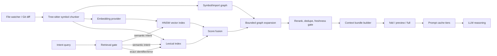

# Kế hoạch nâng cấp harness truy xuất và đóng gói ngữ cảnh mã nguồn

## Tóm tắt quyết định

Harness nên được nâng cấp theo ba đường song song nhưng tách biệt bằng feature flag:

1. Bổ sung chỉ mục semantic theo symbol và kết hợp với BM25 hiện hữu bằng hybrid retrieval; không thay thế lexical search bằng vector-only.
2. Nâng `read_compressed_code` thành API đọc đa độ phân giải trong một lượt: cấu trúc toàn cục, preview cho vùng liên quan và thân đầy đủ cho symbol trọng tâm.
3. Chuẩn hóa prompt thành các lớp prefix ổn định, có khóa nội dung và chính sách cache riêng theo nhà cung cấp; không coi cache nội bộ 60 giây hiện tại là prompt/KV caching.

Ba cơ chế kiểm soát bắt buộc để tránh làm loãng context là selective retrieval, ngân sách token cứng và provenance đến từng symbol/range. Kết quả semantic chỉ được thêm khi vượt ngưỡng hữu ích; graph expansion phải bị giới hạn; nội dung cần sửa hoặc kiểm chứng phải là mã nguồn nguyên văn, không phải bản tóm tắt sinh bởi mô hình.

Phân tích phụ thuộc của GitNexus xác nhận hai seam phù hợp để tích hợp đầu tiên là `CodeSearchEngine`/`createSearchCodebaseFastTool` và `createReadCompressedCodeTool`, đều có mức rủi ro LOW. Các adapter/prompt class có blast radius HIGH. `AgentLoop.runInternal` có mức CRITICAL và ảnh hưởng năm execution flows, nên phần nối main loop chỉ được thêm sau khi policy độc lập đã qua test deterministic/fail-open; rollout mặc định là `shadow`, còn `enforce` phải được bật tường minh.

## Trạng thái triển khai

Các phase không chạm main-loop CRITICAL đã được triển khai:

| Hạng mục | Trạng thái | Rollout mặc định |
|---|---|---|
| Symbol chunking + provenance SHA-256 | Hoàn tất | Dùng khi semantic index được kích hoạt |
| Persistent HNSW + exact fallback | Hoàn tất | Semantic search `off` |
| Learned embedding provider interface + local deterministic baseline | Hoàn tất | Local baseline nếu không cấu hình provider |
| Hybrid BM25/dense RRF + selective gate + import graph expansion | Hoàn tất | `MINUS_SEMANTIC_SEARCH=off`, `MINUS_SELECTIVE_CONTEXT=off` |
| Adaptive `fold`/`preview`/`full` reading | Hoàn tất | Bật, nhưng chỉ chạy khi caller yêu cầu `fidelity="adaptive"` |
| Context bundle policy: budget, freshness, dedupe, marginal utility | Hoàn tất tại tool seam | Chưa nối vào main-loop arbiter |
| Cache envelope SHA-256 + provider capability mapping | Hoàn tất | `observe`; provider body changes chỉ khi `on` |
| Anthropic TTL, OpenAI body fields, Gemini explicit cached content | Hoàn tất và có contract test | Gemini explicit cache `off` |
| Repository-local benchmark và regression suite | Hoàn tất | Chạy thủ công/CI script |
| Reliable tool orchestration state machine | Hoàn tất | `shadow`; chuỗi broad-to-narrow, fail-open |
| AST symbol extraction cho `read_file(symbol)` | Hoàn tất | TS/JS compiler AST; Python indentation; heuristic có confidence |
| Qualified method support trong `get_symbol_context_360` | Hoàn tất | Method definition/reference chính xác theo vị trí |
| Nối orchestration policy vào `AgentLoop.runInternal` | Hoàn tất có feature gate | `shadow`; `enforce` opt-in và chỉ scope khi confidence cao |

Benchmark proxy sau đợt triển khai orchestration: 12 task, 416 file, 2.985 symbol chunks; HNSW hoạt động không warning; hybrid Recall@10 bằng BM25 (`0.75`, không hồi quy); adaptive reading giảm second-read mô phỏng từ 11 xuống 0. Integration test ở `enforce` hoàn tất chuỗi `search_codebase_fast → get_symbol_context_360 → read_file(symbol) → analyze_impact` với `followed=4`, `invalidCycles=0`. Vì local hash embedding chưa đạt mục tiêu tăng recall 15%, semantic rollout vẫn giữ `off`; orchestration giữ `shadow` mặc định cho đến khi có corpus issue/commit held-out.

## 1. Phạm vi và tiêu chí thiết kế

Mục tiêu của kế hoạch này là tăng xác suất đưa đúng bằng chứng mã nguồn vào bước reasoning, đồng thời giảm:

- số lần gọi công cụ để chuyển từ outline sang thân hàm;
- số token không liên quan;
- thời gian đến token đầu tiên do prefix lặp lại;
- nguy cơ context cũ, trùng lặp hoặc không có provenance.

Kế hoạch không nhằm xây một “chat với codebase” chung chung, không thay thế static analysis/call graph, và không giả định rằng context window lớn tự giải quyết được retrieval. Nghiên cứu về “lost in the middle” cho thấy hiệu năng có thể giảm khi bằng chứng nằm giữa context dài; tăng số tài liệu từ 20 lên 50 chỉ đem lại cải thiện nhỏ trong thí nghiệm được báo cáo.[^1] Vì vậy, recall của retriever và precision của context bundle phải được đo riêng.

## 2. Hiện trạng đã xác minh trong codebase

### 2.1 Tìm kiếm mã nguồn

`src/search/code-search-engine.ts` hiện lập chỉ mục toàn bộ file bằng MiniSearch với các trường `path`, `filename`, `symbols` và `content`. Ranking sử dụng BM25, boost theo trường, fuzzy/prefix search và literal fallback. Đây là lexical retrieval tốt cho identifier và chuỗi lỗi, nhưng không phải embedding model học từ code.

`src/tools/search-code-tool.ts` bọc engine thành `search_codebase_fast`, duy trì LRU tối đa tám workspace và trả snippet/line. API hiện chưa có semantic score, graph score, index revision, lý do loại bỏ hoặc context budget.

Codebase có `rsGenerateSubwordEmbedding` và cosine similarity trong `src/native/index.ts`, nhưng fallback là vector hash FNV từ subword/character n-gram kèm synonym nhỏ. Nó hữu ích như baseline rẻ và deterministic, nhưng không nên được mô tả là learned code-semantic embedding. Cơ chế này hiện phục vụ tool retrieval và memory retrieval, chưa tạo vector index toàn cục cho mã nguồn.

`src/agent/graph-ranked-repository-map.ts` đã xây graph import/reference và dùng personalized PageRank hai chiều để chọn signature theo ngân sách. Đây là prior cấu trúc có giá trị và nên được tái sử dụng sau bước semantic/lexical seed retrieval, thay vì nhúng toàn bộ logic graph vào vector index.

### 2.2 Đọc mã nén

`src/tools/repomix-tool.ts` gọi Repomix với `compress: true|false`. Khi nén, thân hàm bị loại bỏ và agent phải gọi `read_file` nếu cần kiểm chứng chi tiết. API chưa nhận `focusSymbols`, range, mức fidelity theo file hoặc tổng ngân sách token.

Repomix hiện hỗ trợ ba mức đầu ra theo pattern: full content, compressed content và directory structure only; rule đầu tiên khớp sẽ thắng.[^2] Do đó có thể tạo một bundle hỗn hợp ngay trong một lần pack: full cho symbol/file trọng tâm, compressed cho hàng xóm cấu trúc và directory-only cho phần còn lại. Đây là thay đổi có rủi ro thấp vì tận dụng dependency đã có, không cần đưa thêm parser/runtime vào critical path.

### 2.3 Prompt và cache

`src/llm/prompt-assembler.ts` lắp các section theo thứ tự ổn định, nhưng `getCacheSignature` chỉ là hash 32-bit cộng chiều dài trên toàn prompt. Đây không phải khóa nội dung đủ mạnh để dùng xuyên provider hoặc làm invalidation manifest.

`src/agent/dynamic-context-cache.ts` là memo một entry theo task với TTL 60 giây. Nó giảm tính toán trong process, không phải provider-side prefix/KV cache.

Adapter Anthropic đã gắn `cache_control` cho system block và tool cuối. Adapter Gemini chỉ đọc `cachedContentTokenCount`, chưa tạo/reuse explicit cached content. Adapter DeepSeek gửi cache key dưới custom HTTP header, trong khi cache prefix của DeepSeek là tự động dựa trên prefix trùng khớp.[^3] Request options đã có `promptCacheKey`, `enablePromptCaching`, retention và breakpoint nhưng chưa được ánh xạ nhất quán sang capability của từng provider.

### 2.4 Baseline nội bộ

Benchmark `npm run benchmark:context -- --iterations=3` trên checkout hiện tại cho composite score `0.9333`, relevant retention `1.0`, stale leak `0`, prompt block precision `1.0` và median context tokens `34` so với baseline `379`. Tool retriever latency tăng từ khoảng `1.09 ms` lên `5.18 ms`; memory retrieval tăng từ `1.27 ms` lên `2.33 ms`.

Đây là benchmark synthetic/deterministic, không phải bằng chứng task-success trên repository thực. Nó cho thấy arbiter và staleness gate hiện tại nên được giữ làm control, nhưng chưa trả lời semantic retrieval có tìm đúng symbol cho truy vấn tự nhiên hay adaptive reading có giảm tool round-trip hay không.

## 3. Tổng hợp bằng chứng nghiên cứu

| Cơ chế | Bằng chứng thực nghiệm | Cách áp dụng an toàn |
|---|---|---|
| Iterative retrieval-generation | RepoCoder báo cáo cải thiện hơn 10% so với in-file setting và cho thấy completion vừa sinh có thể làm query vòng sau tốt hơn; nhiều hơn hai vòng không ổn định và tăng latency.[^4] | Cho phép tối đa một lần refinement tự động trong một tool call; không tạo vòng lặp retrieval vô hạn. |
| Selective RAG / retrieval abstention | Repoformer nhận thấy retrieval thường không giúp hoặc có thể gây hại; selective retrieval đạt tới 70% speedup mà không làm giảm chất lượng trong thiết lập của nghiên cứu.[^5] | Query gate quyết định lexical-only, hybrid hoặc no-retrieval; ghi lại lý do abstain. |
| Code-specific dense retrieval | CodeRetriever học biểu diễn semantic từ cặp code-text và code-code, cải thiện trên 11 code-search task, sáu ngôn ngữ và nhiều mức hạt.[^6] | Dùng embedding model chuyên code qua provider interface; chunk theo symbol thay vì file cố định. |
| Search → graph expand → refine | RepoHyper dùng semantic graph để tìm code liên quan về cấu trúc nhưng không nhất thiết giống về ngữ nghĩa.[^7] LocAgent dùng graph file/class/function và báo cáo file localization 92.7%, chi phí thấp hơn khoảng 86% trong thiết lập của bài.[^8] | Dense/BM25 tạo seed; graph chỉ mở rộng 1–2 hop với decay và cap; reranker loại hàng xóm không đóng góp. |
| Hierarchical localization | Agentless định vị theo file, class/function rồi mới đến edit location.[^9] AutoCodeRover dùng AST entities và iterative search để giải SWE-bench issues.[^10] | Trả kết quả theo hierarchy và cho phép nâng fidelity ở node đã chọn, không đọc toàn file sớm. |
| Multi-resolution code view | LocAgent định nghĩa `fold`, `preview`, `full` cho entity retrieval.[^8] SWE-agent cho thấy interface gọn và giới hạn viewer 100 dòng/lượt tốt hơn output dài gây nhiễu trong các ablation của họ.[^11] | Một response chứa outline rộng, preview hẹp và full body rất hẹp; không mặc định full top-k. |
| Query-aware compression | LongLLMLingua báo cáo tăng chất lượng với khoảng 4× ít token trên một số QA benchmark; RECOMP học selective augmentation và nén context mạnh với mất mát nhỏ trong thiết lập của bài.[^12][^13] | Chỉ thử ở metadata/neighbor context; không nén thân symbol đang sửa. Đây là bằng chứng chuyển miền, cần benchmark code-local. |
| Incremental syntax index | Tree-sitter hỗ trợ incremental parsing và changed ranges.[^14] | Rechunk chỉ file/range thay đổi, cập nhật vector tombstone theo content hash. |
| ANN vector search | HNSW cung cấp approximate nearest-neighbor search với trade-off recall/latency có thể điều chỉnh.[^15] | HNSW là backend mặc định cho local persistent index; exact brute-force dùng cho corpus nhỏ và test oracle. |

Kết luận quan trọng từ các nghiên cứu không phải “đưa thêm code vào prompt”, mà là tạo pipeline có quyền từ chối retrieval, định vị theo cấp, mở rộng có kiểm soát và dừng khi marginal utility thấp.

## 4. Kiến trúc đích



### 4.1 Semantic Retrieval Plane

#### Chunking

Đơn vị chính là symbol, không phải cửa sổ token tùy ý. Mỗi record nên có:

- `chunkId = sha256(repoId, normalizedPath, symbolKind, qualifiedName, sourceHash)`;
- path, ngôn ngữ, symbol kind, qualified name, signature;
- docstring/comment gần nhất;
- body hoặc body digest;
- line range chính xác;
- imports, exports, callers/callees nếu đã có graph;
- commit/index revision và parser version.

File-level summary chỉ là record phụ để recall đường dẫn; không được thay symbol chunks. Với ngôn ngữ Tree-sitter chưa hỗ trợ tốt, fallback là outline hiện tại hoặc fixed window có overlap, được đánh dấu `parserConfidence=low`.

#### Embedding provider

Tạo interface độc lập với vendor:

```ts
interface CodeEmbeddingProvider {
  readonly modelId: string;
  readonly dimensions: number;
  embedDocuments(items: EmbeddingInput[]): Promise<Float32Array[]>;
  embedQuery(query: EmbeddingQuery): Promise<Float32Array>;
}
```

Provider production phải là model tối ưu cho code retrieval. Có thể benchmark dịch vụ như Voyage code embeddings hoặc model local như Jina code embeddings, nhưng không hard-code một model trước khi đo trên repository/ngôn ngữ thực tế.[^16][^17] `rsGenerateSubwordEmbedding` được giữ làm fallback/offline baseline, không làm default semantic provider.

#### Persistent vector index

Backend local đầu tiên nên là HNSW persistent, có metadata sidecar và write-ahead manifest. Các thuộc tính bắt buộc:

- upsert/delete theo content hash;
- tombstone và compact nền;
- atomic index revision;
- exact-search mode cho test nhỏ;
- dimension/model mismatch buộc rebuild có kiểm soát;
- không gửi source ra dịch vụ embedding nếu policy workspace cấm.

Không cần triển khai distributed vector database ở giai đoạn đầu. Với một checkout, local sidecar giảm vận hành và làm rollback đơn giản.

#### Hybrid ranking

Pipeline đề xuất:

1. Phân loại query: exact symbol/path/error, natural-language intent, hoặc mixed.
2. Lấy BM25 top 40 và dense top 40 độc lập.
3. Hợp nhất bằng Reciprocal Rank Fusion để tránh score calibration mong manh.
4. Thêm boost nhỏ cho path/symbol exact match.
5. Mở rộng tối đa 1 hop mặc định, 2 hop chỉ khi query đòi flow/impact; tối đa 12 neighbor.
6. Rerank top 24 theo query–signature–snippet; loại duplicate/near-duplicate.
7. Dừng khi score dưới threshold hoặc token marginal utility không đủ.
8. Trả top result theo ngân sách, không theo `k` cố định.

Graph score là một feature trong reranking, không được tự động kéo cả cluster vào context.

### 4.2 Adaptive multi-resolution reading

Giữ nguyên contract cũ và thêm trường tùy chọn:

```ts
type ReadCompressedCodeInput = {
  paths?: string[];
  path?: string;
  compress?: boolean;                 // backward compatible
  fidelity?: "compressed" | "adaptive" | "full";
  focusSymbols?: string[];
  focusRanges?: Array<{ path: string; start: number; end: number }>;
  previewLines?: number;
  maxTokens?: number;
  includeDirectoryStructure?: boolean;
};
```

Với `fidelity="adaptive"`, builder tạo một response duy nhất:

- `full`: thân nguyên văn của `focusSymbols`/`focusRanges` và dependency trực tiếp cần chứng minh;
- `preview`: signature cộng 20–40 dòng quanh match cho candidate kế tiếp;
- `fold`: imports/exports/signatures cho file lân cận;
- `directory-only`: sơ đồ package/module nếu còn ngân sách.

Mỗi segment trả `path`, `startLine`, `endLine`, `sourceHash`, `fidelity`, `selectionReason`, `retrievalScores` và `expandHint`. Agent vẫn có thể gọi `read_file`, nhưng phần lớn trường hợp “outline rồi mới cần body của match đã biết” được giải quyết trong một round-trip.

Không nên tự full-expand mọi match. Nếu query là điều tra kiến trúc, bundle có thể toàn `fold/preview`; nếu query là sửa một hàm, symbol đó phải là `full` còn callers chỉ cần `fold/preview`.

### 4.3 Context policy chống dilution

Tạo `ContextBundlePolicy` độc lập trước khi nối vào `DynamicContextArbiter`:

```ts
type ContextCandidate = {
  id: string;
  tokens: number;
  lexicalScore?: number;
  semanticScore?: number;
  graphScore?: number;
  freshness: "current" | "stale" | "unknown";
  fidelity: "fold" | "preview" | "full";
  required: boolean;
};
```

Policy phải bảo đảm:

- exact symbol/path match không bị dense result đẩy xuống;
- stale hoặc revision khác bị loại trước ranking;
- full-body được ưu tiên cho target mutation/verification;
- neighbor có cùng nội dung bị dedupe theo source hash;
- tổng token không vượt hard budget;
- phần liên quan nhất nằm gần instruction/query động, tránh chôn giữa context;
- nếu confidence thấp, trả “insufficient evidence” và expansion hint thay vì thêm hàng loạt file.

Selective retrieval gate có ba đầu ra: `none`, `lexical`, `hybrid`. Các truy vấn đã có path + line rõ ràng thường không cần vector search; query về intent/chức năng không biết identifier là ứng viên hybrid; câu hỏi ngoài code không được kích hoạt index.

### 4.4 Prompt caching phân cấp

Prompt nên được canonicalize thành các tier ổn định:

| Tier | Nội dung | Vòng đời | Quy tắc |
|---|---|---|---|
| T0 | system policy, tool schema nền | theo model/tool version | Bất biến, đứng đầu tuyệt đối. |
| T1 | project instructions, architecture map, dependency manifest | theo repo revision/config hash | Cache dài hơn; invalidation theo content hash. |
| T2 | task goal, accepted plan, stable evidence | theo task revision | Không chứa timestamp hoặc counter thay đổi vô ích. |
| T3 | tool result mới, active query, short-term state | mỗi step | Dynamic tail; không cố cache. |

Khóa cache phải dùng SHA-256 trên canonical bytes cộng `provider`, `model`, `toolSchemaVersion`, `repoRevision` và policy version. Session ID chỉ là routing hint, không phải content key.

Provider capability matrix:

- Anthropic: dùng explicit breakpoint ở cuối T0/T1 và, khi đủ lớn, T2; tối đa bốn breakpoint, TTL 5 phút hoặc 1 giờ theo nhu cầu.[^18]
- Gemini: implicit caching cần common prefix chính xác; explicit `cachedContents` phù hợp với repository/system context dùng lặp lại và hỗ trợ TTL.[^19]
- OpenAI-compatible: đặt prefix tĩnh trước, quan sát `cached_tokens`; khi API hỗ trợ, truyền `prompt_cache_key` và `prompt_cache_retention` trong request body thay vì header tùy biến.[^20]
- DeepSeek: tận dụng automatic prefix caching; giữ tool/system prefix byte-identical và đọc cache-hit usage nếu provider trả về.[^3]

Prompt caching giảm compute/latency nhưng không tăng context-window capacity: cached tokens vẫn là context mà model phải chú ý, và với Gemini chúng vẫn tính vào token limit.[^19] Vì vậy caching không thay selective retrieval hoặc token budgeting.

Một chi tiết quan trọng là tool list. Sort deterministic là cần nhưng chưa đủ; nếu dynamic tool selection thay đổi schema giữa các step thì prefix bị invalidation. Toolset nên được “freeze per turn”, hoặc T0 chỉ chứa core schemas bất biến và capability phụ chuyển sang một catalog nhỏ ở T2.

## 5. Thiết kế API và telemetry

### 5.1 Mở rộng `search_codebase_fast`

```ts
type SearchCodebaseInput = {
  query: string;
  limit?: number;
  fuzzy?: boolean;
  mode?: "auto" | "lexical" | "hybrid" | "semantic";
  contextMode?: "hits" | "adaptive_bundle";
  maxContextTokens?: number;
  graphExpansion?: "none" | "dependencies" | "impact" | "auto";
};
```

Response mới vẫn giữ `hits` cũ và bổ sung:

```ts
type SearchDiagnostics = {
  indexRevision: string;
  retrievalMode: string;
  abstained: boolean;
  scoreComponents: Record<string, number>;
  expandedFrom?: string;
  omittedReason?: string;
  sourceHash: string;
  latencyMs: Record<string, number>;
};
```

Semantic failure phải degrade về lexical, không làm tool fail. Nếu index đang build, response ghi `semanticStatus="warming"`.

### 5.2 Sự kiện đo lường

Không log source body theo mặc định. Log cấu trúc:

- query class và hash;
- candidate IDs/hashes, ranks và score components;
- token trước/sau dedupe;
- index revision/freshness;
- số lần expansion và fidelity;
- tool call kế tiếp có đọc lại cùng symbol không;
- cache write/read tokens, TTFT và invalidation reason;
- task outcome từ eval harness.

Telemetry này cho phép tính “second-read rate” mà không lưu code nhạy cảm.

## 6. Phân tích tác động và rủi ro

Kết quả GitNexus sau khi cập nhật index lên 5.971 symbols, 17.964 relationships và 300 execution flows:

| Seam/symbol | Risk | Direct dependents | Affected processes | Quyết định |
|---|---:|---:|---:|---|
| `CodeSearchEngine` | LOW | 2 | 0 | Có thể mở rộng qua composition/sidecar. |
| `createSearchCodebaseFastTool` | LOW | 2 | 1 | Điểm canary chính, giữ response cũ. |
| `createReadCompressedCodeTool` | LOW | 2 | 1 | Tích hợp adaptive fidelity ngay sau test. |
| `DynamicContextCache` | LOW | 4 | 1 test flow | Có thể thêm telemetry, không dùng thay provider cache. |
| `DeepseekLLM` | MEDIUM | 6 | 0 | Sửa mapping request sau contract test. |
| `GraphRankedRepositoryMap` | HIGH | 5 | 3 | Chỉ đọc kết quả qua adapter; chưa sửa thuật toán ở phase đầu. |
| `DynamicContextArbiter` | HIGH | 6 | 3 | Giữ nguyên control; shadow bundle trước. |
| `PromptAssembler` | HIGH | 10 | 4 | Không refactor trực tiếp trước cache conformance suite. |
| `GeminiLLM` | HIGH | 13 | 2 | Adapter change cần canary theo provider. |
| `AnthropicLLM` | HIGH | 8 | 3 | Adapter change cần canary và cost audit. |
| `AgentLoop.runInternal` | CRITICAL | 1 | 5 | Không sửa trong rollout này; cần canary/authority riêng. |

Không thay đồng thời retrieval, arbiter và prompt assembly. Phase đầu chỉ tích hợp retrieval qua seam LOW hoặc adapter có contract test; điểm CRITICAL được giữ nguyên và các thay đổi HIGH đều có flag rollback.

## 7. Lộ trình triển khai

Thời lượng dưới đây là ước lượng cho một kỹ sư quen codebase; mỗi phase có thể phát hành độc lập.

### Phase 0 — Contract và benchmark (3–5 ngày)

- Thêm corpus eval gồm query exact identifier, error string, natural-language intent, cross-file behavior và negative/no-retrieval.
- Gắn gold file, symbol và line range từ lịch sử issue/commit; tách train/tuning và test theo repository/time để tránh leakage.
- Ghi baseline BM25, current graph map, token count, p50/p95 latency, second-read rate và task success.
- Định nghĩa schema version cho chunk/index/result và feature flags.

Exit gate: benchmark chạy deterministic trong CI; có ít nhất 100 query đa dạng và 20 task end-to-end trước canary production.

### Phase 1 — Adaptive read, rủi ro LOW (1–2 tuần)

- Mở rộng `createReadCompressedCodeTool` với `fidelity`, `focusSymbols`, `focusRanges`, `previewLines`, `maxTokens`.
- Dùng Repomix pattern overrides cho full/compressed/directory-only.
- Thêm provenance, source hash và expand hints.
- Giữ `compress` cũ nguyên semantics.

Exit gate: giảm ít nhất 40% lượt `read_file` thứ hai trên tập task cần thân hàm; exact body/source hash khớp 100%; không tăng median output token quá ngân sách đã khai báo.

### Phase 2 — Semantic index chạy shadow, rủi ro LOW tại seam (2–4 tuần)

Các module đề xuất:

- `src/search/semantic-chunker.ts`
- `src/search/embedding-provider.ts`
- `src/search/vector-store.ts`
- `src/search/semantic-code-index.ts`
- `src/search/hybrid-ranker.ts`

Index build chạy background; query semantic chạy shadow và chỉ log ranking, chưa đổi output. Incremental update theo content hash/Tree-sitter changed ranges; lexical search vẫn luôn sẵn sàng.

Exit gate: natural-language required-symbol Recall@10 tăng ít nhất 15% tương đối so với BM25; exact-symbol Recall@10 không giảm; stale result rate bằng 0; warm p95 không quá 2× lexical hoặc 300 ms, lấy ngưỡng chặt hơn nếu chạy local.

### Phase 3 — Hybrid search canary (1–2 tuần)

- Thêm RRF, exact-match boost, bounded graph expansion và query gate.
- Canary 5% → 25% → 100% cho `mode="auto"`; explicit `lexical` luôn là escape hatch.
- Chỉ trả adaptive bundle khi client yêu cầu.

Exit gate: context precision ≥ 0.70, required-symbol recall ≥ 0.95 trên eval; task success không thấp hơn control quá 1 điểm phần trăm với bootstrap confidence interval; token/context không tăng quá 10% nếu success không tăng.

### Phase 4 — Cache envelope theo provider (2 tuần)

Module đề xuất:

- `src/llm/cache-envelope.ts`
- `src/llm/provider-capabilities.ts`
- `src/llm/cache-manifest.ts`

Đầu tiên chỉ canonicalize, hash và quan sát prefix. Sau đó bật breakpoint/explicit cache riêng cho từng provider. Không sửa đồng thời `PromptAssembler` và tất cả adapter.

Exit gate: cache-hit tokens ≥ 70% ở workload lặp steady-state; TTFT giảm ít nhất 20%; prompt bytes và output quality không đổi so với control; kiểm tra riêng retention, data residency và Zero Data Retention trước khi bật cache dài.[^20]

### Phase 5 — Nối context policy vào main loop, rủi ro CRITICAL (đã triển khai shadow)

- Đưa `ContextBundlePolicy` vào shadow cạnh `DynamicContextArbiter`.
- So sánh selection/dropped evidence từng step.
- Bật cho read-only/explanation task trước, mutation task sau.
- Chỉ khi non-inferiority gate đạt mới cân nhắc hợp nhất logic hoặc thay đổi `PromptAssembler`.

Trạng thái hiện tại: policy state machine đã được nối vào main loop sau khi test độc lập đạt. `shadow` chỉ ghi quyết định và telemetry; `enforce` chỉ giới hạn các tool retrieval cạnh tranh khi quyết định có confidence đủ cao, giữ nguyên tool ngoài nhóm context và fail-open nếu tool ưu tiên không khả dụng. Chưa bật `enforce` mặc định.

Exit gate: required evidence preservation 100% cho target mutation; stale leak 0; tool-loop count và total tokens giảm mà task success không suy giảm.

## 8. Feature flags và rollback

Các flag độc lập:

- `MINUS_SEMANTIC_SEARCH=off|shadow|on`
- `MINUS_ADAPTIVE_CODE_READ=off|on`
- `MINUS_CACHE_ENVELOPE_V2=off|observe|on`
- `MINUS_SELECTIVE_CONTEXT=off|shadow|on`
- `MINUS_RELIABLE_TOOL_ORCHESTRATION=off|shadow|enforce`

Rollback không được yêu cầu rebuild repository:

- tắt semantic search trả ngay về MiniSearch;
- adaptive read vẫn chấp nhận input cũ;
- cache manifest có thể bỏ mà prompt bytes không đổi;
- context policy shadow không ảnh hưởng arbiter hiện tại;
- orchestration shadow không lọc tool; enforce tự bỏ scope nếu preferred/fallback không hiện diện;
- vector index đặt ngoài source tree và có versioned directory để xóa/rebuild an toàn.

Circuit breaker tự động nên tắt semantic path nếu embedding timeout/error vượt ngưỡng, dimension mismatch, index revision cũ hơn workspace hoặc p95 latency vượt budget liên tục.

## 9. Những việc không nên làm

- Không thay BM25 bằng vector-only: identifier, path và error literal là thế mạnh của lexical search.
- Không embed nguyên file làm đơn vị duy nhất; file lớn trộn nhiều intent và làm provenance kém.
- Không đưa full body của top-k file vào prompt mặc định.
- Không dùng LLM-generated summary làm bằng chứng duy nhất cho code sẽ sửa.
- Không để graph expansion không giới hạn theo cluster/call graph.
- Không coi cache hit là lý do giữ context không liên quan; cache không giải quyết attention dilution.
- Không dùng session ID hoặc hash 32-bit làm cache identity.
- Không gửi source/proprietary comments đến embedding API trước khi có workspace policy và redaction/allowlist.
- Không sửa `PromptAssembler`, `DynamicContextArbiter` và nhiều provider adapter trong cùng một release.

## 10. Thứ tự ưu tiên đề xuất

Thứ tự có tỷ lệ lợi ích/rủi ro tốt nhất là:

1. Adaptive mixed-fidelity reading trên Repomix hiện có.
2. Bộ benchmark retrieval/context và telemetry second-read.
3. Symbol-level semantic index chạy shadow, hybrid với BM25.
4. Selective retrieval và bounded graph expansion ở tool seam.
5. Cache envelope quan sát-only, rồi bật từng provider.
6. Cuối cùng mới tích hợp bundle policy vào arbiter/main loop.

Hai hạng mục đầu giải quyết round-trip và tạo nền đo lường mà gần như không chạm critical path. Semantic shadow cho phép chọn embedding model bằng dữ liệu thay vì cảm tính. Prompt caching có thể đem lại tiết kiệm rõ rệt, nhưng chỉ sau khi prefix ổn định và capability từng provider được biểu diễn đúng; nếu làm trước, cache miss sẽ khó chẩn đoán và dễ bị nhầm với cải thiện retrieval.

## Nguồn

[^1]: Nelson F. Liu và cộng sự, “Lost in the Middle: How Language Models Use Long Contexts,” TACL 2024 / arXiv. https://arxiv.org/abs/2307.03172
[^2]: Repomix, “Configuration: File Processing Levels,” tài liệu chính thức. https://repomix.com/guide/configuration
[^3]: DeepSeek, “Context Caching is All You Need,” tài liệu API chính thức. https://api-docs.deepseek.com/guides/kv_cache/
[^4]: Shuo Zhang và cộng sự, “RepoCoder: Repository-Level Code Completion Through Iterative Retrieval and Generation,” EMNLP 2023. https://arxiv.org/abs/2303.12570
[^5]: Zora Zhiruo Wang và cộng sự, “Repoformer: Selective Retrieval for Repository-Level Code Completion,” ICML 2024. https://arxiv.org/abs/2403.10059
[^6]: Shuyan Zhou và cộng sự, “CodeRetriever: Unimodal and Bimodal Contrastive Learning for Code Search,” EMNLP 2022. https://aclanthology.org/2022.emnlp-main.187/
[^7]: Weimin Lyu và cộng sự, “RepoHyper: Search-Expand-Refine on Semantic Graphs for Repository-Level Code Completion,” arXiv 2024. https://arxiv.org/abs/2403.06095
[^8]: Zhenlong Li và cộng sự, “LocAgent: Graph-Guided LLM Agents for Code Localization,” ACL 2025. https://arxiv.org/abs/2503.09089
[^9]: Chunqiu Steven Xia và cộng sự, “Agentless: Demystifying LLM-based Software Engineering Agents,” arXiv 2024. https://arxiv.org/abs/2407.01489
[^10]: Yuntong Zhang và cộng sự, “AutoCodeRover: Autonomous Program Improvement,” ISSTA 2024. https://arxiv.org/abs/2404.05427
[^11]: John Yang và cộng sự, “SWE-agent: Agent-Computer Interfaces Enable Automated Software Engineering,” NeurIPS 2024. https://arxiv.org/abs/2405.15793
[^12]: Huiqiang Jiang và cộng sự, “LongLLMLingua: Accelerating and Enhancing LLMs in Long Context Scenarios via Prompt Compression,” ACL 2024. https://aclanthology.org/2024.acl-long.91/
[^13]: Fangyuan Xu và cộng sự, “RECOMP: Improving Retrieval-Augmented LMs with Compression and Selective Augmentation,” ICLR 2024. https://proceedings.iclr.cc/paper_files/paper/2024/file/bda88ed2892f5e61c9a9bf215c566913-Paper-Conference.pdf
[^14]: Tree-sitter, “Advanced Parsing: Editing,” tài liệu chính thức. https://tree-sitter.github.io/tree-sitter/using-parsers/3-advanced-parsing.html
[^15]: Yu. A. Malkov và D. A. Yashunin, “Efficient and Robust Approximate Nearest Neighbor Search Using Hierarchical Navigable Small World Graphs,” IEEE TPAMI. https://arxiv.org/abs/1603.09320
[^16]: Voyage AI, “Embeddings,” tài liệu model chính thức. https://docs.voyageai.com/docs/embeddings
[^17]: Jina AI, “Jina Code Embeddings,” model card chính thức. https://jina.ai/models/jina-code-embeddings-1.5b/
[^18]: Anthropic, “Prompt caching,” tài liệu Claude API chính thức. https://platform.claude.com/docs/en/build-with-claude/prompt-caching
[^19]: Google, “Context caching,” tài liệu Gemini API chính thức. https://ai.google.dev/gemini-api/docs/caching
[^20]: OpenAI, “Prompt caching,” tài liệu API chính thức. https://platform.openai.com/docs/guides/prompt-caching
