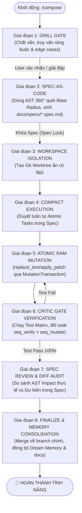

# 🏗️ KẾ HOẠCH TÍCH HỢP: SPEC-DRIVEN AUTONOMOUS CODING ENGINE
## Hợp Nhất Tính Kỷ Luật Đặc Tả Của MiMo Compose Mode & Chiều Sâu AST, An Toàn Cơ Học Của Minus CLI

> **Trạng thái:** DRAFT / PROPOSED  
> **Mục tiêu:** Xây dựng một **Spec-Driven Autonomous Coding Engine** hoàn chỉnh, kết hợp kỷ luật phát triển theo đặc tả (Spec-as-Code, Grill Gate, Compact Lifecycle) từ Xiaomi MiMo Code với năng lực thấu hiểu mã nguồn 360° AST, kiểm soát giao dịch RAM Preflight và cổng nghiệm thu bằng chứng thực tế (`CriticGate`) của Minus CLI.

---

## 📑 MỤC LỤC
1. [Tầm Nhìn Kiến Trúc & Triết Lý Thiết Kế](#1-tầm-nhìn-kiến-trúc--triết-lý-thiết-kế)
2. [Mô Hình Vòng Đời 8 Giai Đoạn (The 8-Stage Compose Engine)](#2-mô-hình-vòng-đời-8-giai-đoạn-the-8-stage-compose-engine)
3. [Kiến Trúc Kỹ Thuật Chi Tiết Của Các Thành Phần Mới](#3-kiến-trúc-kỹ-thuật-chi-tiết-của-các-thành-phần-mới)
4. [Lộ Trình Triển Khai Chi Tiết (5 Phases Phân Tầng)](#4-lộ-trình-triển-khai-chi-tiết-5-phases-phân-tầng)
5. [Cấu Trúc Dữ Liệu & Schema Chuẩn Tắc](#5-cấu-trúc-dữ-liệu--schema-chuẩn-tắc)
6. [Hệ Thống Cam Kết Bất Biến (System Invariants)](#6-hệ-thống-cam-kết-bất-biến-system-invariants)
7. [Kế Hoạch Kiểm Thử & Tiêu Chí Nghiệm Thu](#7-kế-hoạch-kiểm-thử--tiêu-chí-nghiệm-thu)

---

## 🎯 1. TẦM NHÌN KIẾN TRÚC & TRIẾT LÝ THIẾT KẾ

### 1.1. Bối cảnh & Điểm nghẽn hiện tại
* **Hạn chế của mô hình hội thoại tự do (Conversational / Ad-hoc Agent):** Agent dễ bị "ảo giác tiến độ", vội vã sửa code khi chưa thấu hiểu hết các ràng buộc và edge cases, dẫn đến việc sửa chữa chắp vá, phá vỡ kiến trúc sẵn có.
* **Hạn chế của MiMo Code nguyên bản:** Dù có kỷ luật Spec xuất sắc và quy trình chặt chẽ, MiMo Code thiếu khả năng phân tích tĩnh sâu (chủ yếu dựa vào grep/FTS5 text search) và thiếu cơ chế RAM Preflight chống ô nhiễm đĩa khi sửa code thất bại.
* **Sự kết hợp hoàn hảo:**
  $$\text{MiMo Compose Discipline (Spec + Grill + Lifecycle)} + \text{Minus CLI Engine (360° AST + RAM Preflight + CriticGate)} = \textbf{Next-Gen Spec-Driven Agent}$$

```text
┌──────────────────────────────────────────────────────────────────────────────────────────────────┐
│                                 SPEC-DRIVEN AUTONOMOUS ENGINE                                    │
├──────────────────────────────────────────────────┬───────────────────────────────────────────────┤
│         🌟 MIMO COMPOSE DISCIPLINE               │           ⚡ MINUS CLI MECHANICAL ENGINE      │
├──────────────────────────────────────────────────┼───────────────────────────────────────────────┤
│ • Grill Gate (Phản biện & Khai phá yêu cầu)      │ • Native AST 360° Knowledge Graph             │
│ • Spec-as-Code bền vững (docs/specs/*.spec.md)   │ • 5-Stage RAM Preflight (MutationTransaction) │
│ • Vòng đời Compact Pipeline (/compose-next)      │ • Evidence-Gated Completion (CriticGate)      │
│ • Workspace / Worktree Isolation                 │ • Blackboard OCC + Event Bus Swarm            │
│ • Persistent Cross-Session Memory                │ • Graceful 429 Quota Suspension Protocol      │
└──────────────────────────────────────────────────┴───────────────────────────────────────────────┘
```

---

## 🔄 2. MÔ HÌNH VÒNG ĐỜI 8 GIAI ĐOẠN (THE 8-STAGE COMPOSE ENGINE)

Quy trình phát triển một tính năng hoặc tái cấu trúc module lớn sẽ tuân thủ tuyệt đối chu trình 8 bước:



### Chi tiết 8 giai đoạn:
1. **Grill Gate (Khai phá chủ động):** Trước khi tạo plan, agent bắt buộc kích hoạt chế độ thẩm vấn. Quét nhanh AST để tìm các điểm nhạy cảm (breaking changes, database models, auth handlers) và đặt câu hỏi trắc nghiệm/làm rõ cho user.
2. **Spec-as-Code Formulation:** Sinh file Markdown bền vững `docs/specs/<feature-name>.spec.md`. Tự động nhúng sơ đồ AST Call Graph, bảng Blast Radius (các file/hàm bị ảnh hưởng) và Ma trận Kiểm thử Chấp thuận (Acceptance Test Matrix).
3. **Workspace Isolation:** Tự động tạo một Git Worktree cô lập tại `.minus/worktrees/<feature-name>` để toàn bộ quá trình thử nghiệm, build, test không làm bẩn workspace chính của lập trình viên.
4. **Compact Execution (`/compose-next`):** Build Agent chính nắm giữ hợp đồng tự trị khép kín, duyệt qua từng task mà không cần spawn đa subagent lãng phí token, giữ quyền kiểm soát cho lập trình viên ở mỗi phase boundary.
5. **Atomic RAM Mutation:** Sửa đổi mã nguồn qua cơ chế 5 bước với khóa băm SHA-256 OCC. Kiểm tra cú pháp và kiểu dữ liệu trên RAM trước khi ghi xuống đĩa Worktree.
6. **Evidence-Gated Verification:** Cổng [`CriticGate`](file:///D:/AgentLearn/CodingAgent/src/agent/critic-gate.ts) đọc trực tiếp Test Matrix trong file Spec, ép buộc phải có log chạy test thành công (`exitCode === 0`) với timestamp sau lần sửa code cuối cùng.
7. **Spec Review & Diff Audit:** Đối chiếu git diff của Worktree với các mục tiêu trong Spec, bảo đảm không có file thừa, không có tác dụng phụ (side effects) ngoài phạm vi đã đăng ký.
8. **Finalize & Dream Consolidation:** Hợp nhất Worktree vào nhánh làm việc, cập nhật tài liệu kỹ thuật và kích hoạt [`DreamManager`](file:///D:/AgentLearn/CodingAgent/src/dream/dream-manager.ts) lưu lại kinh nghiệm vào `.knowledge/DREAM_INSIGHTS.md`.

---

## 🧱 3. KIẾN TRÚC KỸ THUẬT CHI TIẾT CỦA CÁC THÀNH PHẦN MỚI

```text
src/
├── agent/
│   ├── compose-controller.ts         # [MỚI] Bộ điều phối vòng đời Compose Mode 8 bước
│   ├── grill-gate.ts                 # [MỚI] Động cơ thẩm vấn & phát hiện điểm mù yêu cầu
│   ├── spec-manager.ts               # [MỚI] Quản lý sinh, đọc, khóa và đối soát Spec-as-Code
│   ├── plan-manager.ts               # [NÂNG CẤP] Tích hợp 2 chiều với Spec-as-Code
│   ├── critic-gate.ts                # [NÂNG CẤP] Xác thực Acceptance Test Matrix từ Spec
│   └── agent-loop.ts                 # [NÂNG CẤP] Tích hợp lệnh /compose và /compose-next
│
├── workspace/
│   ├── worktree-manager.ts           # [MỚI] Quản lý Git Worktree Sandbox cô lập
│   └── mutation-transaction.ts       # [HIỆN CÓ] RAM Preflight Transaction
│
├── tools/
│   ├── compose-tools.ts              # [MỚI] Tools: generate_spec, lock_spec, verify_spec_matrix
│   └── codebase-intelligence.ts      # [HIỆN CÓ] Cung cấp dữ liệu AST 360° nạp vào Spec
│
└── dream/
    └── dream-manager.ts              # [NÂNG CẤP] Tiếp nhận Trajectory từ Compose hoàn tất
```

### 3.1. `GrillGate` (`src/agent/grill-gate.ts`)
* **Chức năng:** Phân tích prompt của user kết hợp với AST 360° để phát hiện các lỗ hổng logic:
  - Thiếu định nghĩa xử lý lỗi / Fallback.
  - Xung đột API signature hiện có (dựa vào `inspect_symbol` và `get_route_map`).
  - Thiếu kịch bản di chuyển dữ liệu (Data migration / Schema change).
* **Đầu ra:** Bảng câu hỏi tương tác dạng CLI Selection / Confirm trước khi cho phép chuyển sang giai đoạn tạo Spec.

### 3.2. `SpecManager` (`src/agent/spec-manager.ts`)
* **Chức năng:** Quản lý vòng đời file Markdown `docs/specs/<feature-name>.spec.md`:
  - `generateSpec(objective, grillAnswers, astContext)`: Sinh cấu trúc Markdown chuẩn mực.
  - `lockSpec(specPath)`: Khóa mã băm SHA-256 của Spec để đảm bảo không bị Agent tự ý sửa đổi tiêu chí nghiệm thu trong lúc code.
  - `evaluateAcceptanceCriteria(specPath, executionEvidence)`: Đối chiếu bằng chứng từ `CriticGate` với từng dòng Acceptance Criteria trong Spec.

### 3.3. `WorktreeManager` (`src/workspace/worktree-manager.ts`)
* **Chức năng:** Tương tác với Git để tạo và dọn dẹp các thư mục làm việc cô lập:
  - `createWorktree(featureName)`: Khởi tạo worktree tại `.minus/worktrees/<feature-name>` tách từ `HEAD`.
  - `syncPreflightChanges(worktreePath, changes)`: Đẩy các thay đổi từ RAM Preflight vào worktree.
  - `mergeAndCleanup(featureName)`: Squash-merge hoặc Fast-forward merge về branch chính khi toàn bộ bài test vượt qua, sau đó xóa worktree an toàn.

---

## 📅 4. LỘ TRÌNH TRIỂN KHAI CHI TIẾT (5 PHASES PHÂN TẦNG)

### 📍 Phase 1: Nền Tảng Đặc Tả & Cơ Chế Khảo Vấn (Spec-as-Code & Grill Gate)
- [ ] **Task 1.1:** Xây dựng [`GrillGate`](file:///D:/AgentLearn/CodingAgent/src/agent/grill-gate.ts) hỗ trợ phân tích điểm mù yêu cầu dựa trên AST context.
- [ ] **Task 1.2:** Xây dựng [`SpecManager`](file:///D:/AgentLearn/CodingAgent/src/agent/spec-manager.ts) quản lý định dạng file `docs/specs/*.spec.md` với mã băm toàn vẹn SHA-256.
- [ ] **Task 1.3:** Tích hợp `codebase-intelligence.ts` để tự động nhúng danh sách symbol ảnh hưởng và Call Graph vào file Spec.
- [ ] **Task 1.4:** Bổ sung Tool `generate_spec` và `lock_spec` vào [`ToolRegistry`](file:///D:/AgentLearn/CodingAgent/src/tools/registry.ts).

### 📍 Phase 2: Môi Trường Cô Lập (Git Worktree Sandbox Manager)
- [ ] **Task 2.1:** Hiện thực [`WorktreeManager`](file:///D:/AgentLearn/CodingAgent/src/workspace/worktree-manager.ts) quản lý tạo, switch và giải phóng Git Worktree tự động.
- [ ] **Task 2.2:** Điều chỉnh [`Workspace`](file:///D:/AgentLearn/CodingAgent/src/workspace/workspace.ts) và `ToolRunner` để hỗ trợ chuyển đổi linh hoạt ngữ cảnh thực thi giữa Root Workspace và Active Worktree.
- [ ] **Task 2.3:** Đảm bảo [`MutationTransaction`](file:///D:/AgentLearn/CodingAgent/src/workspace/mutation-transaction.ts) tương thích hoàn toàn khi commit vào Worktree.

### 📍 Phase 3: Bộ Điều Phối Vòng Đời Compose (`ComposeController` & `/compose-next`)
- [ ] **Task 3.1:** Hiện thực [`ComposeController`](file:///D:/AgentLearn/CodingAgent/src/agent/compose-controller.ts) cài đặt máy trạng thái 8 bước (Grill $\to$ Spec $\to$ Worktree $\to$ Implement $\to$ Verify $\to$ Review $\to$ Finalize $\to$ Finish).
- [ ] **Task 3.2:** Bổ sung các lệnh Slash Command mới vào CLI REPL:
  - `/compose <objective>`: Bắt đầu quy trình Compose mới.
  - `/compose-next`: Tiến hành bước tiếp theo trong hợp đồng tự trị.
  - `/compose status`: Xem tiến độ thực thi đối chiếu với Spec.
  - `/compose abort`: Hủy bỏ an toàn, dọn dẹp worktree và phục hồi trạng thái sạch.
- [ ] **Task 3.3:** Cập nhật [`AgentLoop`](file:///D:/AgentLearn/CodingAgent/src/agent/agent-loop.ts) để điều hướng các lượt suy luận tuân thủ theo phase hiện tại của Compose.

### 📍 Phase 4: Nâng Cấp Cổng Nghiệm Thu (`CriticGate` & Acceptance Test Matrix)
- [ ] **Task 4.1:** Nâng cấp [`CriticGate`](file:///D:/AgentLearn/CodingAgent/src/agent/critic-gate.ts) để phân tích bảng Ma trận Kiểm thử trong file Spec (`| Test Case | Command | Expected Output | Status |`).
- [ ] **Task 4.2:** Bắt buộc `submit_solution` phải chứng minh 100% các dòng test trong Test Matrix đã chuyển sang `PASSED` dựa trên bằng chứng thực tế từ `run_command`.
- [ ] **Task 4.3:** Xây dựng cơ chế tự động đối chiếu Git Diff so với danh sách file đăng ký trong Spec để phát hiện "Unregistered File Modifications".

### 📍 Phase 5: Hợp Nhất Tri Thức Dài Hạn & Tối Ưu Hóa Trải Nghiệm (Memory & Polish)
- [ ] **Task 5.1:** Kết nối kết quả của Compose hoàn tất với [`DreamManager`](file:///D:/AgentLearn/CodingAgent/src/dream/dream-manager.ts), tự động trích xuất bài học kỹ thuật vào `.knowledge/DREAM_INSIGHTS.md`.
- [ ] **Task 5.2:** Bổ sung thanh hiển thị tiến độ trực quan (Interactive Progress Dashboard) trong CLI UI.
- [ ] **Task 5.3:** Viết toàn bộ 50+ Test Cases chuyên biệt cho Compose Engine trong `test-suite.ts`.

---

## 📋 5. CẤU TRÚC DỮ LIỆU & SCHEMA CHUẨN TẮC

### 5.1. Cấu trúc File Spec Chuẩn (`docs/specs/<feature>.spec.md`)
```markdown
# 📋 SPECIFICATION: [Tên Tính Năng]
> **Spec ID:** SPEC-20260824-001  
> **Status:** LOCKED (Hash: sha256-a1b2c3d4...)  
> **Author:** Minus Compose Engine + Developer  

---

## 🎯 1. Mục Tiêu Nghiệp Vụ (Business Objectives)
- Xây dựng module xác thực JWT đa tầng có hỗ trợ refresh token xoay vòng.

## 🔍 2. Khảo Vấn Ràng Buộc (Grill Insights & Constraints)
- [x] Không được phá vỡ route `/api/v1/legacy-auth`.
- [x] Sử dụng Redis cho danh sách token thu hồi (Blacklist).

## 🗺️ 3. Phân Tích AST & Blast Radius (Codebase Intelligence)
- **Files bị ảnh hưởng:**
  - `src/auth/jwt-service.ts` (Callers: 12, Callees: 4)
  - `src/middleware/auth-guard.ts` (API Routes: 8)
- **API Routes mới:**
  - `POST /api/v2/auth/refresh`
  - `POST /api/v2/auth/revoke`

## 📝 4. Danh Sách Tác Vụ Thực Thi (Atomic Implementation Tasks)
- [ ] **Task 1:** Khởi tạo `src/auth/token-rotator.ts` và unit test khung.
- [ ] **Task 2:** Cập nhật `jwt-service.ts` qua RAM Preflight.
- [ ] **Task 3:** Đăng ký route mới trong `src/server.ts`.

## 🧪 5. Ma Trận Kiểm Thử Nghiệm Thu (Acceptance Test Matrix)
| ID | Kịch Bản Kiểm Thử | Lệnh Thực Thi | Kết Quả Kỳ Vọng | Trạng Thái | Evidence Timestamp |
| :--- | :--- | :--- | :--- | :---: | :--- |
| TC-01 | Issue token hợp lệ | `npm test test/jwt.test.ts` | `2 passed` | ⏳ PENDING | - |
| TC-02 | Chặn token hết hạn | `npm test test/jwt-expire.test.ts`| `1 passed` | ⏳ PENDING | - |
| TC-03 | Linter & Typecheck | `npm run build` | `Exit Code 0` | ⏳ PENDING | - |
```

### 5.2. TypeScript Interface cho `ComposeState`
```typescript
export type ComposePhase =
  | 'GRILL'
  | 'SPEC_DRAFT'
  | 'SPEC_LOCKED'
  | 'WORKSPACE_READY'
  | 'IMPLEMENTING'
  | 'VERIFYING'
  | 'REVIEWING'
  | 'FINALIZING'
  | 'COMPLETED'
  | 'ABORTED';

export interface ComposeTaskMatrixItem {
  id: string;
  scenario: string;
  command: string;
  expectedExitCode: number;
  status: 'PENDING' | 'PASSED' | 'FAILED';
  evidenceSummary?: string;
  verifiedAt?: string;
}

export interface ComposeState {
  id: string;
  featureName: string;
  phase: ComposePhase;
  specPath: string;
  specHash?: string;
  worktreePath?: string;
  grillQnA: Array<{ question: string; answer: string }>;
  testMatrix: ComposeTaskMatrixItem[];
  createdAt: string;
  updatedAt: string;
}
```

---

## 🛡️ 6. HỆ THỐNG CAM KẾT BẤT BIẾN (SYSTEM INVARIANTS)

Khi tích hợp Compose Mode vào Minus CLI, hệ thống bắt buộc duy trì **6 nguyên tắc bất biến thép**:

1. **No Code Without Spec Lock (Bất biến Đặc tả):** Tuyệt đối không thực thi bất kỳ thao tác chỉnh sửa mã nguồn nào (`replace_text`, `write_file`) khi file Spec chưa được khóa mã băm SHA-256 (`specHash`).
2. **Deterministic Evidence Verification (Bất biến Nghiệm thu):** `CriticGate` từ chối nghiệm thu nếu bất kỳ mục nào trong `Acceptance Test Matrix` chưa có log bằng chứng thực thi thành công sau lần sửa code cuối cùng (`seq_verify > seq_mutate`).
3. **Zero Main-Branch Pollution During Run (Bất biến Cô lập):** Mọi thao tác build, test trung gian và chỉnh sửa thử nghiệm đều diễn ra trên Worktree cô lập; nhánh chính của người dùng không bao giờ rơi vào trạng thái lỗi biên dịch (broken build).
4. **AST-Enriched Traceability (Bất biến Truy nguyên):** Mọi file sửa đổi thực tế phải nằm trong danh mục `Blast Radius` đã đăng ký trong Spec; cảnh báo tức thì nếu phát hiện thay đổi ngoài phạm vi.
5. **Durable Cross-Session Continuity (Bất biến Bền vững):** File Spec và toàn bộ trạng thái `ComposeState` được lưu trên đĩa; nếu quá trình chạy bị gián đoạn (hết quota 429, tắt máy), người dùng chỉ cần gõ `/compose-next` để tiếp tục chính xác từ phase dở dang.
6. **Zero KV-Cache Degradation (Bất biến Hiệu năng):** Thứ tự nạp ngữ cảnh của Compose Mode tuân thủ nghiêm ngặt cấu trúc phân tầng Prefix Cache của Minus CLI, duy trì tỷ lệ trúng Cache $\ge 85\%$.

---

## 🧪 7. KẾ HOẠCH KIỂM THỬ & TIÊU CHÍ NGHIỆM THU

Hệ thống kiểm thử tự động của dự án sẽ được bổ sung Section 37 trong `test-suite.ts` để kiểm thử toàn diện 100% tính năng mới:

| ID | Test Scenario | Phương Pháp Kiểm Thử | Tiêu Chuẩn Vượt Qua |
| :--- | :--- | :--- | :---: |
| **TEST-CMP-01** | Khảo vấn Grill Gate | Kích hoạt với prompt mơ hồ | Trả về danh sách câu hỏi làm rõ, chặn tạo Spec khi chưa trả lời. |
| **TEST-CMP-02** | Sinh Spec & Khóa Hash | Gọi `generate_spec` & `lock_spec` | File markdown được tạo đúng format, mã băm SHA-256 chuẩn xác. |
| **TEST-CMP-03** | Khởi tạo Worktree | Kích hoạt giai đoạn Workspace | Thư mục worktree tách biệt được tạo, workspace trỏ đúng thư mục. |
| **TEST-CMP-04** | Chặn sửa code khi chưa khóa Spec | Gọi `replace_text` ở phase `SPEC_DRAFT` | Bị từ chối bởi Tool Safety Policy với mã lỗi `SPEC_NOT_LOCKED`. |
| **TEST-CMP-05** | CriticGate đối soát Matrix | Giả lập 2/3 test pass, gọi `submit_solution` | Bị từ chối, chỉ rõ test case còn thiếu (`TC-03 PENDING`). |
| **TEST-CMP-06** | Hoàn tất & Merge an toàn | Toàn bộ test pass, gọi finalize | Worktree được merge về root, thư mục tạm bị dọn dẹp sạch sẽ. |
| **TEST-CMP-07** | Phục hồi phiên dở dang | Giả lập crash ở phase `IMPLEMENTING` | Gõ `/compose-next` khôi phục đúng task và worktree tương ứng. |

---

## 🚀 KẾT LUẬN & BƯỚC ĐI TIẾP THEO

Bản kế hoạch này định hình một chuẩn mực mới cho Autonomous Coding Agent: Không chỉ là một trợ lý viết code thụ động, mà là một **Kỹ sư Phần mềm Tự trị có Kỷ luật Đặc tả Cao cấp**.

### Các hành động đề xuất tiếp theo:
1. Review và phê duyệt kế hoạch kiến trúc.
2. Bắt đầu triển khai **Phase 1: `GrillGate` & `SpecManager`** trong `src/agent/`.
3. Cập nhật CLI UI để hỗ trợ các tương tác hỏi đáp của Grill Gate và hiển thị tiến trình của Spec Matrix.
