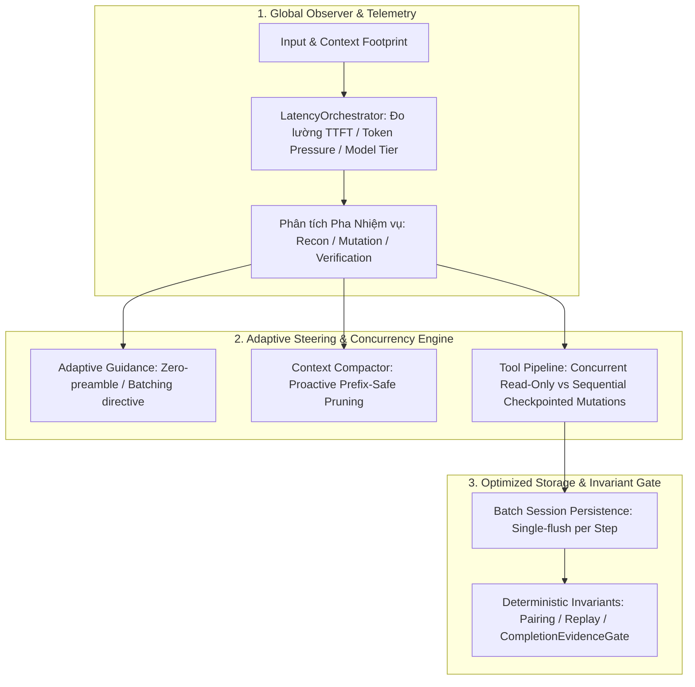

# Global Latency & Strategic Performance Orchestration (V2)

## Goal
Nâng cấp `AgentLoop` và `LatencyOrchestrator` thành hệ thống điều phối hiệu năng toàn cục (*Global Strategic Performance Orchestrator*) — tự động quan sát, đo lường toàn diện luồng dữ liệu end-to-end (từ nén context, stream LLM, thực thi song song tool đến ghi đĩa), nhận định điểm nghẽn và đưa ra định hướng thực thi tối ưu nhất theo từng pha nhiệm vụ mà vẫn bảo toàn 100% các Invariants và tính an toàn của hệ thống.

---

## Global Strategic Architecture (Kiến trúc & Tầm nhìn Toàn cục)

---

## Safety & Invariant Guards (Các Chốt Chặn Toàn Cục)
1. **Mutation Isolation (Cách ly đột biến):** Mọi tool gây thay đổi workspace (`write_file`, `replace_text`, `apply_patch`), lệnh hệ thống (`run_command`), và git mutations **luôn chạy tuần tự 100%** và bắt buộc tạo Shadow Git Checkpoint trước khi chạy.
2. **Deterministic History Pairing:** Khi chạy song song các tool đọc, kết quả được sắp xếp và ghi vào `Session` đúng theo thứ tự mảng `toolCalls` ban đầu, bảo vệ KV-cache prefix và tính tái lập (*replayability*).
3. **Chống Goal Hallucination:** Giữ nguyên các chốt chặn thực nghiệm cứng của `CompletionEvidenceGate` và `VerificationPolicy`. Không bao giờ cho phép kết thúc nếu thiếu kết quả test thực tế.
4. **Zero-Breaking Feature Flags:** Từng cơ chế đều có thể bật/tắt độc lập qua biến môi trường (`MINUS_LATENCY_OPTIMIZATION`, `MINUS_CONCURRENT_READ_TOOLS`, `MINUS_SUBMIT_AUTO_FINALIZATION`).

---

## Tasks

- [ ] **Task 1: Nâng cấp `LatencyOrchestrator` thành Global Systemic Profiler**
  - Bổ sung khả năng tự động nhận diện Model Tier (Fast/Flash ~20s, Standard/Pro ~45s, DeepReasoning/Thinking ~60s).
  - Phân tích trạng thái tải của toàn bộ request (system prompt, dynamic context, tools schema, output reserve).
  - Tự động sinh chỉ dẫn định hướng theo pha: triệt tiêu preamble token thừa khi đang trong pha hành động, khuyến khích gộp tool đọc khi đang trinh sát, và hướng tới `submit_solution` khi đã đủ bằng chứng kiểm chứng.
  - *Verify:* Test unit kiểm tra `LatencyOrchestrator` tính đúng footprint, resolve đúng target theo model tier, và sinh guidance chính xác.

- [ ] **Task 2: Triển khai Concurrent Read-Only Tool Pipeline trong `AgentLoop`**
  - Phân tách danh sách `toolCalls` thành các khối (*partitions*): nhóm các tool đọc liên tiếp (`read_file`, `list_files`, `search_text`, `inspect_symbol`, `get_diagnostics`) để chạy đồng thời bằng `Promise.allSettled`.
  - Giữ nguyên luồng tuần tự và Shadow Git Checkpoint cho các tool đột biến.
  - Ghép nối kết quả vào `Session` đảm bảo đúng thứ tự ban đầu và phát event telemetry rõ ràng.
  - *Verify:* Test benchmark với batch 3-4 file reads, xác nhận chạy song song và history pairing không bị xáo trộn ID.

- [ ] **Task 3: Tối ưu Batch Session Persistence cho Multi-Tool Steps**
  - Trong các step có nhiều tool calls, ghi nhận toàn bộ kết quả vào in-memory event log của `Session` và chỉ thực hiện `persistSession()` duy nhất 1 lần khi toàn bộ batch tool kết thúc (trừ khi gặp tool mutation cần lưu checkpoint ngay).
  - *Verify:* Đo số lần ghi đĩa trong step multi-tool, xác nhận giảm từ $N$ lần xuống $1$ lần mà dữ liệu đĩa vẫn đầy đủ.

- [ ] **Task 4: Memoize Dynamic Context giữa các Step cùng Task**
  - Thiết lập bộ nhớ đệm cache ngắn hạn cho `graphRepositoryMap` và `repositoryMemory.recall()`.
  - Tự động vô hiệu hóa cache khi có workspace mutation; tái sử dụng context đã tính toán giữa các step đọc liên tiếp trong cùng 1 active task.
  - *Verify:* Kiểm tra pre-flight assembly không quét lại đồ thị symbol nếu không có thay đổi file.

- [ ] **Task 5: Mở rộng Regression & Benchmark Suite trong `test-latency-optimization.ts`**
  - Bổ sung các kịch bản kiểm thử: concurrency tool reads, mutation safety gating, batch persistence integrity, adaptive latency guidance, và session invariant replay.
  - In báo cáo tổng hợp hiệu năng (thời gian tiết kiệm, số lượng I/O giảm, cache hit rate).
  - *Verify:* Chạy `npm run test:latency` xác nhận 100% test pass.

---

## Done When
- [ ] Tất cả 5 tasks được hoàn thành và vượt qua kiểm chứng thực nghiệm độc lập.
- [ ] Session Invariants và Tool Pairing Invariants đạt 100% tính toàn vẹn khi chạy song song.
- [ ] `npm run test:latency` và `npm test` vượt qua toàn bộ các bài test.
- [ ] Hệ thống có khả năng tự thích ứng và điều phối độ trễ linh hoạt theo từng model provider và pha nhiệm vụ.
